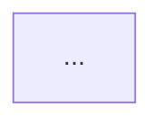

# Reusable patterns and pipeline document contract

## Established recurring patterns

Across production reports, studies, repositories, and the earlier Antiky corpus, several mechanics
recur even though no source states one universal sequence:

- Start from a durable target: test case, game configuration, acceptance criteria, hierarchical
  plan, visual contract, or stable placeholder manifest.
- Make work small and dependency-ordered.
- Constrain generation behind stable paths, schemas, parameters, or APIs.
- Run the real artifact. Compilation and package validation are necessary but not playability.
- Feed observable evidence back into revision: logs, live state, screenshots, video, telemetry,
  diagnostic views, or human observations.
- Bound repair loops and retain unresolved failures.
- Keep high-coupling creative choices under human selection.
- Preserve history: alternatives, configurations, prompts, observations, fixes, and accepted
  revisions.
- Use specialized automation inside an existing process before attempting whole-studio autonomy.

These are established as recurring source fragments. The combined sequence is an **inference**.

## Inferred common anatomy

A useful taxonomy for comparing pipelines is:

1. Intent or question
2. Preconditions and current-state inspection
3. Constraints and acceptance
4. Bounded artifact or change
5. Build, import, or compile
6. Persisted-state readback
7. Runtime scenario
8. State, motion, visual, performance, or player evidence
9. Independent or human judgment where required
10. Defect routing and revision
11. Approval, rejection, rollback, package, or publish

Not every pipeline needs every stage. Missing stages must be reported, not inserted to make a
source look complete.

## Pipeline page contract

The owner's proposed page is viable, but the evidence concerns require a small extension. A
five-minute page should contain:

```markdown
# <Pipeline Name>

**Status:** Established | Claimed | Inferred
**Context:** <source-specific engine, discipline, scale, or limitation>
**Evidence date:** <YYYY-MM-DD>
**Primary source:** <author and direct link>



## Pipeline Details

### Inputs and preconditions
### Stages
### Artifacts
### Gates and feedback loops
### Failure and stop conditions
### Roles

## Supporting Skills

### Observed
- `<skill-or-tool>`: named or used by the source.

### Potential
- `<skill-name>`: portable boundary inferred by this research.

## Evidence

- What is established
- What is claimed
- What is inferred
- Use and maturity signals
- Independent validation
- Gaps and contradictions
```

The added header and evidence section prevent a concise diagram from looking more authoritative
than its sources.

## Mermaid rules

- Keep the main diagram to about five to nine primary nodes.
- Put only author-stated order in the main flow.
- Show a decision only when the source has a real gate or branch.
- Show the principal backward edge or stop path.
- Name important artifacts on nodes or transitions.
- Move engine-specific implementation detail into Pipeline Details, but preserve a source-specific
  variant when removing it would change the method.
- Do not silently add research, QA, human approval, provenance, or release stages.
- If multiple sources support a synthesis, label the diagram inferred and list every source.

## Supporting-skill boundaries

The following potential skill families recur. Their names and boundaries are inferred, not proof
that equivalent public skills exist:

| Family | Narrow responsibility |
| --- | --- |
| `experience-or-test-brief` | State the player, question, expected behavior, non-goals, and rejection criteria |
| `acceptance-contract` | Turn intent into observable pass, fail, and refusal conditions |
| `decompose-playable-slice` | Produce dependency-ordered work without expanding scope |
| `bounded-change-packet` | Declare targets, permissions, rollback, and required evidence |
| `stable-placeholder-interface` | Keep projects runnable while content changes behind fixed identities |
| `compile-import-build-proof` | Run the authoritative transformation and preserve its output |
| `persisted-state-readback` | Reload or query the changed state before claiming success |
| `deterministic-runtime-scenario` | Run fixed inputs and expected checkpoints |
| `game-surface-capture` | Capture game-only visual or motion evidence with metadata |
| `performance-evidence` | Bind measurement to build, device, scenario, and trace |
| `human-playtest-research` | Plan, consent, observe, code, synthesize, and preserve dissent |
| `visual-target-review` | Compare gameplay-camera evidence against approved direction |
| `finding-router` | Return a defect to the stage and artifact that owns it |
| `asset-provenance` | Record source, rights, transformations, hashes, and restrictions |
| `rollback-and-recovery` | Restore and verify the previous accepted state |

## Gaps in the document contract

- The objective does not yet say whether a source-specific pipeline and its generalized variant
  should be separate files.
- It does not set an evidence threshold for the first pass.
- It does not say whether technical pipelines that agents can execute, but which are not inherently
  AI-specific, belong in the library.
- It does not say whether discipline-level loops and end-to-end production flows share one index.
- Supporting skills may be observed, inferred, nonexistent, or unsuitable. A single unqualified
  list would blur those states.

