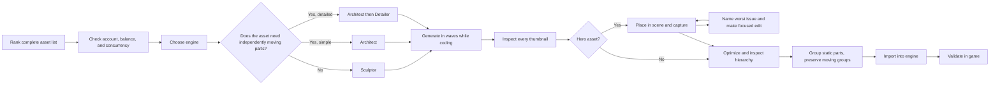
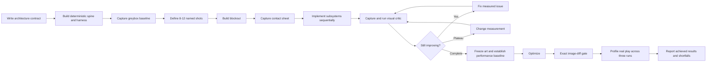
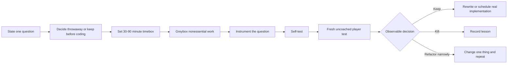
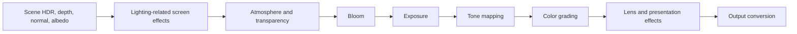
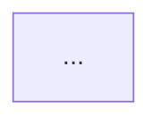

```mermaid
flowchart LR
    A[Inspect the existing game] --> B[Lock technical frame]
    B --> C[Name visual system]
    C --> D[Create asset manifest]
    D --> E[Approve one hero target in game context]
    E --> F[Produce coherent families in small batches]
    F --> G[Normalize deterministically]
    G --> H[Configure engine import]
    H --> I[Review contact sheet]
    I --> J[Validate in game at native resolution]
    J --> K[Record source, license, and edit history]
```

# Named targets and their source graph

**Research date:** 2026-08-16  
**Method:** Read-only inspection of the three named public repositories, their histories, authors, licenses, linked source material, and public demonstrations. No repositories were cloned, dependencies installed, or code executed.

## Evidence labels

- **Established:** Directly visible in source, history, documentation, or a working public artifact.
- **Claimed:** Stated by an author or vendor but not independently reproduced in the inspected evidence.
- **Inferred:** A synthesis from observable material that the author did not state as one complete pipeline.

Stars, forks, contributor counts, and commit volume are maturity or attention signals. They are not evidence that a pipeline is effective.

## Executive finding

The three targets serve different purposes:

1. [thrixel/goal-to-game](https://github.com/thrixel/goal-to-game) describes the most complete end-to-end AI-assisted game-building process. Its asset pipeline is concrete and useful, but its strongest performance and evaluation claims come from a small, young, vendor-authored repository and an unidentified reference project.
2. [gamedev-skills/awesome-gamedev-agent-skills](https://github.com/gamedev-skills/awesome-gamedev-agent-skills) is a broad library of concise process checklists. Several are good pipeline-shaped leads, but the repository does not demonstrate those workflows being used repeatedly on real projects.
3. [scottstts/Threejs-Awesome-Graphics-Agent-Skills](https://github.com/scottstts/Threejs-Awesome-Graphics-Agent-Skills) has the strongest source provenance and public-practice trail. Its author shows shipped Three.js work, exact upstream revisions, accepted and rejected mechanisms, deterministic examples, and visual validation procedures. It is narrowly focused on Three.js graphics rather than the whole game-development lifecycle.

The best first-pass library material is therefore:

- Scott Sun’s visual-system authoring and validation process, labeled as a Three.js-derived discipline pipeline.
- Scott Sun’s final-image/rendering pipeline, labeled as a technical graphics pipeline rather than a general AI-building workflow.
- Thrixel’s asset planning, generation, inspection, optimization, and engine-import loop, preserved first as a source-specific pipeline.

The prototype, game-jam, and general asset-production workflows from `gamedev-skills` are credible research leads. They need actual-use evidence or corroborating sources before being presented as established practice.

---

# Research questions

## 1. Which general game-development pipelines are explicitly documented or demonstrated?

| Candidate | Explicitly documented | Public demonstration or use evidence | Current classification |
| --- | --- | --- | --- |
| Thrixel asset-to-engine loop | Yes | Vendor product site and asset gallery; no independent repository using the complete loop found | **Claimed pipeline with partial public use evidence** |
| Thrixel deterministic Three.js game-build loop | Yes | Author reports one reference FPS and included benchmark results, but the reference project is not identified | **Claimed; important lead** |
| Fast gameplay prototyping | Yes | No linked real prototype runs or decision records | **Claimed checklist; lead** |
| Game-jam delivery | Yes | No linked jam entry produced by following the skill | **Claimed checklist; lead** |
| General game-asset production | Yes | No linked project or asset set produced through the full process | **Claimed checklist; lead** |
| Three.js visual-system authoring and validation | Yes | Deterministic examples, source ledger, author’s live graphics projects | **Established process structure; effectiveness of the agent skill remains claimed** |
| Three.js final-image pipeline | Yes | Examples and mechanisms are present; several derive from identified public projects | **Established technical pipeline** |
| Source-project-to-agent-skill distillation | Not as one ordered document | Exact revisions, license boundaries, accepted and rejected mechanisms are recorded | **Inferred meta-pipeline** |

The skill-router documents in the second and third repositories are useful orchestration mechanisms. They are not, by themselves, game-development pipelines.

## 2. What evidence suggests actual practice rather than promotion or a one-off checklist?

### Stronger evidence

- Scott Sun provides a detailed [source-material ledger](https://github.com/scottstts/Threejs-Awesome-Graphics-Agent-Skills/tree/main/source_materials) with exact repositories, revisions, licenses, mechanisms accepted, mechanisms rejected, and snapshot dates.
- Scott’s [public portfolio](https://scottsun.io/) links live Three.js games and scenes such as MyCraft, Stellar, Interstellar, Elysium Mars Park, Pearl Sea Park, and Friends Apartment.
- The graphics repository includes deterministic examples, diagnostic views, visual baselines, and validation instructions. These make the work inspectable even though they do not constitute an independent evaluation of the agent skills.
- Thrixel’s asset process reflects product capabilities that are visible on the company’s [Goal to Game page](https://thrixel.com/goal-to-game), [home page](https://thrixel.com/), and public gallery.

### Weaker evidence

- Thrixel states that every step was tested with Claude Code, but the inspected repository contains no public end-to-end test harness or reproducible game corpus.
- Its Three.js document reports detailed benchmark and critic-round results, but the approximately 55,000-line reference FPS is not named or linked.
- The `gamedev-skills` repository validates skill structure and routing. This shows maintenance discipline, not that the workflows improve game-development outcomes.
- The `gamedev-skills` README labels its routing demonstration as illustrative.
- Testimonials hosted on a vendor’s own site support product use, but do not independently validate the complete pipeline.

No target contained a controlled independent comparison showing that agents following the pipeline produce better games than agents not following it.

## 3. What stages, artifacts, gates, feedback loops, roles, and failure paths appear?

## Evidence card 1: Thrixel asset-to-engine pipeline

**Status:** **Claimed**, with established documentation and partial vendor-hosted demonstrations.

**Primary sources:**

- [Repository README](https://github.com/thrixel/goal-to-game/blob/main/README.md)
- [Goal-to-game skill](https://github.com/thrixel/goal-to-game/blob/main/skills/goal-to-game/SKILL.md)
- [Three.js integration](https://github.com/thrixel/goal-to-game/blob/main/skills/goal-to-game/engines/threejs/threejs.md)
- [Unity integration](https://github.com/thrixel/goal-to-game/blob/main/skills/goal-to-game/engines/unity.md)
- [Product demonstration](https://thrixel.com/goal-to-game)

**Author-stated flow:**



**Artifacts:**

- Ranked asset manifest, including player visibility and real-world scale.
- List of independently moving parts.
- Project workspace and engine choice.
- Text style guide and approved visual reference.
- Generated GLB or FBX files.
- Thumbnails and in-scene screenshots.
- Named hierarchy and grouped mesh structure.
- Labeled placeholders when credits are exhausted.

**Gates and loops:**

- The account and credit state is checked before generation begins.
- Moving-parts requirements determine the generation path.
- Every thumbnail must be inspected.
- Hero assets enter a repeated in-scene capture, diagnosis, focused-edit loop.
- Actual part names must be inspected before grouping.
- Static geometry is grouped before import while independently moving groups remain separate.
- Engine import is followed by in-game validation.

**Roles:**

- Agent: plans assets, chooses generation route, manages waves, inspects results, edits, optimizes, and imports.
- User: approves spending or account upgrade decisions and may approve the visual target.
- Thrixel services: Architect, Detailer, and Sculptor produce or modify assets.
- Engine: provides the actual gameplay context in which assets are validated.

**Failure handling:**

- When credits run out, the process finishes a playable pass with labeled placeholders, shows the result, and asks whether generation should continue.
- A poor hero asset is not silently accepted; the process names the worst visible problem and applies one focused edit.
- Hierarchies are inspected before destructive grouping.
- Engine validation catches scale, pivot, material, or animation problems that thumbnails cannot reveal.

**Potential portable supporting skills:**

- `plan-game-assets`
- `classify-model-generation-path`
- `write-visual-style-guide`
- `inspect-and-revise-model`
- `optimize-model-hierarchy`
- `import-and-validate-game-assets`

These are inferred skill boundaries, not observed existing skills.

**Provenance and use:**

Thrixel identifies founder [Rana Hanocka](https://thrixel.com/about-us) as a University of Chicago computer-science professor working in 3D deep learning. This is strong 3D-generation provenance. It does not independently establish the game pipeline’s effectiveness.

**Limitations and contradictions:**

- The current skill first describes image-capable input, later says never to pass an image, and elsewhere suggests that Sculptor can receive an image. The source is internally inconsistent about image use.
- The exact process depends on proprietary Thrixel services and their credit/concurrency model.
- The conceptual planning, inspection, hierarchy, and engine-validation stages are portable. The exact tool route is not.
- Claims such as “fully playable,” “rigorously playtested,” or stable performance were not independently reproduced.

---

## Evidence card 2: Thrixel deterministic Three.js build and review

**Status:** **Claimed**. The document is unusually detailed, but its underlying reference project is not publicly identified.

**Primary source:**

- [Three.js process document](https://github.com/thrixel/goal-to-game/blob/main/skills/goal-to-game/engines/threejs/threejs.md)

**Author-stated flow:**



**Artifacts:**

- `ARCHITECTURE.md`.
- Shared context, event vocabulary, and quality budgets.
- Deterministic harness and greybox capture.
- Named shot list and PNG set.
- Contact sheets.
- Debug hooks, self-tests, and benchmarks.
- Baseline images and exact-pixel diffs.
- Profiler results from actual play.
- Final report separating achieved, measured, and missing results.

**Gates and loops:**

- No content work before the architecture contract and spine.
- Greybox capture gates further visual work.
- Each subsystem has one owner or one tightly coupled concern.
- Visual critique runs as capture → contact sheet → critic → fix → recapture.
- A plateau triggers a measurement change rather than more subjective polishing.
- Performance work starts after art settles.
- Optimization must pass an exact image-diff gate.
- Real-play profiling must cover three runs and report p99 behavior and hitches.

**Failure handling:**

- Nondeterminism invalidates image comparison.
- A questionable visual critique is converted into a measurable question.
- Parallel work on tightly coupled visual systems is treated as a defect source.
- Static benchmarks are not accepted as gameplay performance.
- Known shortfalls remain visible in the final report.

**Author-reported results:**

The document states that three rounds of six parallel critic agents improved a score by 0.46 while defect counts changed from 60 to 47 to 66, followed by a sequential pass improving the score by 1 and reducing defects from 66 to 26. It also contrasts a 94 FPS static benchmark with 12–17 FPS during real play.

These are **claimed** results. The reference FPS, benchmark harness, captures, and commit history are not linked, so the measurements cannot be independently checked.

**Potential portable supporting skills:**

- `write-game-architecture-contract`
- `build-deterministic-game-harness`
- `define-visual-shot-list`
- `review-visual-contact-sheet`
- `run-pixel-regression`
- `profile-real-gameplay`
- `report-game-quality-honestly`

**Admission recommendation:** Keep as a high-priority lead. Do not generalize the reported numbers or label it established until the reference project or another repeated application is available.

---

## Evidence card 3: Fast gameplay prototyping

**Status:** **Claimed checklist; research lead.**

**Primary source:**

- [Prototype Fast skill](https://github.com/gamedev-skills/awesome-gamedev-agent-skills/blob/main/skills/workflows/prototype-fast/SKILL.md)

**Author-stated flow:**



**Artifacts:**

- Prototype brief containing the question, core verb, throwaway/keep decision, timebox, and keep/kill criteria.
- Separate prototype project or folder.
- Debug HUD or gizmos.
- Observation notes and final decision record.

**Gates:**

- One question per prototype.
- Hard timebox.
- Observable keep/kill criteria defined before testing.
- At least one fresh player who receives no coaching.
- A kept spike is rewritten or explicitly scheduled; it is not promoted silently.

**Failure paths:**

- Polish replaces learning.
- Multiple systems enter the same prototype.
- The author tests only their own work.
- No decision criteria exist.
- Throwaway code becomes production code through inertia.

**Potential portable supporting skills:**

- `frame-prototype-question`
- `greybox-gameplay-mechanic`
- `instrument-gameplay-question`
- `observe-uncoached-playtest`
- `record-prototype-decision`

**Evidence gap:** No linked prototype, player-observation record, or project history shows this exact process in repeated use. The steps are sensible but remain repository-authored guidance.

---

## Evidence card 4: Game-jam delivery

**Status:** **Claimed checklist; research lead.**

**Primary source:**

- [Game Jam skill](https://github.com/gamedev-skills/awesome-gamedev-agent-skills/blob/main/skills/workflows/game-jam/SKILL.md)

**Author-stated flow:**


**Time structure for a 48-hour jam:**

- Hours 0–2: ideate and lock the concept.
- Hours 2–8: build the core loop with primitives.
- Hours 12–24: content and hook.
- Around hour 30: outside playtest and cuts.
- Hours 30–38: art, audio, and juice.
- Hours 38–44: bug freeze.
- Hours 44–48: export, test, prepare page, and submit, with a target submission around hour 46.

**Artifacts:**

- Rules summary.
- One-sentence concept.
- Scope budget and stretch list.
- Playable 30-second loop.
- Exported archive tested on a clean path.
- Screenshots, submission page, and license information.

**Gates:**

- Mechanic proven in the first third of the available time.
- Final 20% reserved for shipping.
- Feature freeze before final export.
- Clean-path build test.
- Confirmation that the submission is attached and playable.

**Failure paths:**

- Scope creep.
- No shipping buffer.
- Testing only in the editor.
- Missing submission attachment.
- Unlicensed third-party assets.
- Spending the closing hours on features instead of delivery.

**Potential portable supporting skills:**

- `read-game-jam-rules`
- `scope-game-to-deadline`
- `build-gameplay-vertical-loop`
- `test-clean-game-export`
- `package-and-submit-game`

**Evidence gap:** No public jam entry, postmortem, or commit history is linked as an application of the complete skill.

---

## Evidence card 5: General game-asset production

**Status:** **Claimed checklist; strong portable lead.**

**Primary source:**

- [Create Game Assets skill](https://github.com/gamedev-skills/awesome-gamedev-agent-skills/blob/main/skills/disciplines/create-game-assets/SKILL.md)

**Author-stated flow:**



**Artifacts:**

- Art-direction brief.
- Asset manifest containing state, variant, size, pivot, collision, source, license, and status.
- Hero asset or style board.
- Small family batches.
- Deterministically normalized output.
- Contact sheet and QA report.
- Imported engine assets.
- Provenance and edit history.

**Gates:**

- Approve one target before producing a family.
- Check the target at real game scale and against its actual background.
- Normalize with deterministic tools and repeatable settings.
- Inspect both a contact sheet and the asset at native in-game resolution.
- Verify usage rights and provenance.

**Failure handling:**

- A prompt result is not treated as proof of correctness.
- Transparency, sprite grids, seams, pivots, collision, and topology are treated as untrusted until inspected.
- Attractive isolated art does not pass if it fails against the game background or at gameplay scale.

**Potential portable supporting skills:**

- `write-art-direction-brief`
- `manifest-game-assets`
- `normalize-game-assets`
- `review-asset-contact-sheet`
- `validate-assets-in-engine`
- `record-asset-provenance`

**Evidence gap:** The skill contains no external sources for this synthesis and no linked asset set produced with the full process.

---

## Evidence card 6: Three.js visual-system authoring and validation

**Status:** **Established process structure**, supported by public source provenance and author-created demonstrations. The effect of giving this process to an AI agent remains **claimed**.

**Primary sources:**

- [Skill router](https://github.com/scottstts/Threejs-Awesome-Graphics-Agent-Skills/blob/main/skills/threejs-skill-router/SKILL.md)
- [Visual Validation skill](https://github.com/scottstts/Threejs-Awesome-Graphics-Agent-Skills/blob/main/skills/threejs-visual-validation/SKILL.md)
- [Source-material ledger](https://github.com/scottstts/Threejs-Awesome-Graphics-Agent-Skills/tree/main/source_materials)
- [Scott Sun’s live portfolio](https://scottsun.io/)

**Author-stated flow:**



```mermaid
flowchart LR
    A[Define visual contract] --> B[Configure camera and viewing envelope]
    B --> C[Build subject system]
    C --> D[Build motion system]
    D --> E[Share coherent fields and masks]
    E --> F[Validate silhouette and materials without effects]
    F --> G[Add lighting, shadows, and atmosphere]
    G --> H[Add image pipeline last]
    H --> I[Enable only necessary atomic effects]
    I --> J[Freeze deterministic inputs]
    J --> K[Capture final and no-post baselines]
    K --> L[Inspect diagnostics]
    L --> M[Test distance, seeds, extremes, and motion]
    M --> N[Check image, geometry, memory, and timing budgets]
    N --> O[Save small regression set]
```

**Visual contract:**

- Subject.
- Scale.
- Camera.
- Motion.
- Frame budget.

**Artifacts:**

- Visual contract.
- Deterministic seed and camera manifest.
- Final and no-post screenshots.
- Debug views and diagnostic mosaics.
- Near, design-distance, and far captures.
- Stress-seed and extreme-parameter captures.
- Timing data and render-target inventory.
- Quality tiers.
- Invariants, known compromises, and regression captures.

**Gates and feedback:**

- Silhouette and material masks must work without post-processing.
- Effects must expose meaningful perceptual controls.
- Deterministic inputs precede comparison.
- Every system should provide diagnostic views.
- Validation covers camera distance, seed variation, extreme inputs, temporal motion, memory, and frame time.
- A no-post baseline detects effects that conceal weak geometry, lighting, or composition.
- Only needed effects remain enabled.

**Failure paths:**

- Beauty-shot-only validation.
- Tuning before diagnostics exist.
- Nondeterministic camera, time, or seed.
- Post-processing used to hide weak source signals.
- Systems that work only at one camera distance.
- Unbounded geometry, memory, or render-target cost.
- Effects with arbitrary shader constants and no perceptual controls.

**Potential portable supporting skills:**

- `define-visual-contract`
- `route-real-time-graphics-work`
- `build-graphics-debug-views`
- `capture-deterministic-visual-baseline`
- `validate-real-time-visual-system`
- `budget-real-time-graphics`

**Provenance:**

The ledger identifies exact upstream projects, revisions, license boundaries, and whether their mechanisms were accepted or rejected. It includes both Scott’s own shipped projects and external work such as:

- [dgreenheck/ez-tree](https://github.com/dgreenheck/ez-tree)
- [takram-design-engineering/three-geospatial](https://github.com/takram-design-engineering/three-geospatial)
- [jeantimex/three-geospatial](https://github.com/jeantimex/three-geospatial)
- [vibe-stack/procedural-bank](https://github.com/vibe-stack/procedural-bank)

This is the strongest audit trail among the three named targets.

**Limitations:**

- Most demonstrations and the skills share the same author, so this is practice evidence rather than independent validation.
- Implementations are strongly tied to Three.js. The visual contract, diagnostics, distance envelope, determinism, budget, and regression ideas are more portable than the code.
- The root repository is MIT, but the source ledger contains material under other licenses, including GPL boundaries. The root license must not be assumed to relicense copied or derived examples.

---

## Evidence card 7: Three.js final-image pipeline

**Status:** **Established technical pipeline.** It is relevant to AI-assisted building but is principally a rendering pipeline.

**Primary source:**

- [Image Pipeline skill](https://github.com/scottstts/Threejs-Awesome-Graphics-Agent-Skills/blob/main/skills/threejs-image-pipeline/SKILL.md)

**Author-stated signal order:**



**Rules and gates:**

- Tone-map once.
- Apply bloom in HDR before tone mapping.
- Meter exposure from a reduced luminance signal.
- Preserve separate direct and indirect signals when using bent-normal techniques.
- Upsample depth- and normal-aware.
- Implement toggles and effect-only views before tuning.
- Protect UI from inappropriate world post-processing.
- Preserve a no-post baseline.

**Artifacts:**

- Ordered render graph.
- HDR, depth, normal, and albedo buffers.
- Reduced luminance signal.
- Effect toggles and effect-only diagnostic views.
- Final and no-post captures.
- Performance and render-target inventory.

**Potential portable supporting skills:**

- `compose-real-time-image-pipeline`
- `inspect-render-signals`
- `validate-post-processing-order`
- `meter-scene-exposure`
- `protect-ui-from-post-processing`

**Portability:** The ordering and validation concepts apply broadly to real-time 3D engines. APIs and exact mechanisms remain renderer-specific.

---

## 4. Which supporting skills appear portable?

The recurring portable capabilities are:

| Capability | Seen in |
| --- | --- |
| Define a bounded question or contract before building | Fast prototype; Thrixel architecture; Scott visual contract |
| Create a manifest before production | Thrixel assets; general asset production |
| Establish deterministic inputs and captures | Thrixel Three.js; Scott validation |
| Build one thin playable or visible spine early | Fast prototype; game jam; Thrixel greybox |
| Validate in actual context rather than isolation | All asset workflows; prototype playtest; Scott distance envelope |
| Use named gates with observable pass conditions | Every credible candidate |
| Capture diagnostic views before subjective tuning | Thrixel Three.js; Scott graphics |
| Separate production from final optimization | Thrixel; game jam; Scott |
| Record provenance, licenses, and edit history | General asset workflow; Scott source ledger |
| Report shortfalls rather than hiding them | Thrixel Three.js; Scott validation |
| Protect throwaway experiments from becoming production by accident | Fast prototype |
| Reserve time explicitly for packaging and delivery | Game jam |

A useful future skill library would encode these as small capabilities and let pipeline documents compose them. It should not force every engine or project through one universal pipeline.

## 5. Which other targets should be explored?

### Highest priority

1. [Articraft](https://github.com/articraftresearch/Articraft)

   It has an explicit agent loop in [docs/agent.md](https://github.com/articraftresearch/Articraft/blob/main/docs/agent.md): create run and workspace, load system instructions and request, let the model call tools, compile and test the current workspace, iterate until valid, then save status and output. It includes isolated compilation, authored tests, compiler tests, stale-output protection through digests, examples, and a public research paper, [Articraft: A Benchmark and Agent Framework for Programmatic 3D Asset Generation](https://arxiv.org/abs/2605.15187). The paper claims a dataset of more than 10,000 assets across 245 categories and improved quality over baselines. Those empirical claims need examination, but this is a much stronger research target than an unsourced checklist.

2. [Manifest3D](https://github.com/scottstts/Manifest3D)

   Scott Sun describes a constrained workspace in which an agent creates an asset and semantic checklist, an engine verifies it, and the harness iterates creation and repair. The repository and live public application make this a useful bridge between source-traced graphics work and agentic 3D generation. The project acknowledges Articraft as an inspiration.

3. Actual AI-assisted game-jam entries with public repositories and postmortems

   These are needed to test the `game-jam` checklist against real time pressure, feature cuts, clean builds, and submission outcomes. Prefer entries with visible commit timestamps, downloadable builds, rules, and author retrospectives.

4. Actual instrumented gameplay prototypes

   Seek repositories containing prototype briefs, debug instrumentation, uncoached playtest observations, and keep/kill decisions. This would validate or correct the `prototype-fast` workflow.

### Source-graph targets from Scott’s repository

- [dgreenheck/ez-tree](https://github.com/dgreenheck/ez-tree)
- [takram-design-engineering/three-geospatial](https://github.com/takram-design-engineering/three-geospatial)
- [jeantimex/three-geospatial](https://github.com/jeantimex/three-geospatial)
- [vibe-stack/procedural-bank](https://github.com/vibe-stack/procedural-bank)
- Scott Sun’s [Elysium Mars Park](https://github.com/scottstts/Elysium-Mars-Park), with its [live world](https://mars.scottsun.io/)
- Scott’s MyCraft, Stellar, Interstellar, Pearl Sea Park, and Friends Apartment repositories linked from his [portfolio](https://scottsun.io/)
- Official [Three.js examples](https://threejs.org/examples/) for mechanisms that the skills attribute to engine behavior

These should be inspected at the exact revisions recorded in the source ledger, not only at current `main`.

### Thrixel follow-up targets

- The unnamed reference FPS used for the Three.js benchmark and critic rounds.
- Public repositories that used `goal-to-game` from prompt through playable result.
- Raw recordings or source projects behind [Thrixel in Action](https://thrixel.com/thrixel-in-action).
- Independent users willing to expose their asset manifests, revision history, engine imports, and final builds.

## 6. How should a concise pipeline document remain faithful to evidence?

A five-minute pipeline page can stay concise if it separates source fact from library synthesis.

Recommended structure:

```markdown
# Pipeline name

Status: Established | Claimed | Inferred
Context: engine, genre, project scale, or source-specific limits
Primary source and author
Evidence date



## Pipeline details

### Inputs and preconditions
### Stages
### Artifacts
### Gates and feedback loops
### Failure and stop conditions
### Roles

## Supporting skills

### Observed
- Skills or tools explicitly named by the source.

### Potential
- Portable skill boundaries inferred by this research.

## Evidence

- Direct primary sources
- Public applications
- Repository signals
- License
- Gaps and unverifiable claims
```

Rules for faithful capture:

- Put only author-stated ordering in the main diagram.
- Label synthesized abstractions as inferred.
- Preserve source-specific branches when removing them would change the method.
- Do not turn aspirations such as “polished” or “AAA” into acceptance criteria.
- Include the evidence date because repositories and product capabilities change.
- Treat stars, forks, and contributor counts as signals only.
- Keep supporting skills separate from pipeline evidence.
- Record what would falsify or weaken the pipeline.
- Keep license and provenance near the evidence, especially for source-distilled graphics material.

## 7. Which candidates belong in the initial library, and which remain leads?

### Initial library candidates

1. **Three.js visual-system authoring and validation**

   Admit as an engine-derived discipline pipeline. It has explicit stages, deterministic artifacts, diagnostic gates, budgets, public examples, and an unusually strong provenance ledger. State that independent evaluation of the agent-skill package is absent.

2. **Three.js final-image pipeline**

   Admit as a technical graphics pipeline. Its signal ordering, diagnostics, and failure conditions are precise and portable enough to teach, provided engine-specific implementation remains clearly marked.

3. **Thrixel asset-to-engine loop**

   Admit first as a source-specific pipeline, not as a universal standard. Its strongest portable contributions are the ranked asset manifest, moving-parts decision, style target, thumbnail inspection, hero in-context revision, hierarchy inspection, grouping, and engine validation. Mark proprietary Thrixel stages and the unresolved image-input contradiction.

### Research leads, not yet established patterns

- Thrixel deterministic Three.js build and critic loop.
- Fast gameplay prototyping.
- Game-jam delivery.
- General game-asset production.
- The routing algorithms from both skill collections.
- Source-project-to-agent-skill distillation.

These leads are pipeline-shaped and useful, but either depend on an undisclosed example, lack actual-use evidence, or are inferred from repository organization rather than directly stated.

---

# Repository and author signals

Signals were observed on 2026-08-16. GitHub counters can vary between cached repository, organization, and tag pages.

## `thrixel/goal-to-game`

- [Repository](https://github.com/thrixel/goal-to-game)
- Apache-2.0 license.
- Approximately 6 commits visible in the repository history.
- Commits dated August 3, 4, 7, and 12, 2026.
- Named commit authors include Rana Hanocka, Sining Lu, and `pawpaw2022`.
- The [Thrixel organization page](https://github.com/thrixel) showed approximately 40 stars and 13 forks for the repository; another repository view showed a different fork count.
- Public organization membership was hidden.
- Very young history and no inspected public release history.
- Strong founder provenance in 3D research; weak independent evidence for the complete game pipeline.

## `gamedev-skills/awesome-gamedev-agent-skills`

- [Repository](https://github.com/gamedev-skills/awesome-gamedev-agent-skills)
- Apache-2.0 license.
- Approximately 524 stars, 42 forks, 76 commits, and 67 skills.
- Visible activity from June 25 through August 11, 2026.
- Releases [v1.0 and v1.1](https://github.com/gamedev-skills/awesome-gamedev-agent-skills/releases) were published June 25 and June 26, 2026; later work was visible on `main`.
- Named contributors in history include Abhishek Barali, `Unknown-333`, `ishangautam7`, and `zlc000190`.
- The [NOTICE](https://github.com/gamedev-skills/awesome-gamedev-agent-skills/blob/main/NOTICE) describes the skills as original works written from primary documentation, with third-party influence limited to general patterns.
- Maintainer [Abhishek Barali](https://github.com/AbhishekBarali) publicly emphasizes agentic AI, multi-agent systems, RAG, and evaluations. The inspected profile does not establish extensive professional game-development provenance.
- Broad community attention and active maintenance; limited evidence that the workflow pages were used as written.

## `scottstts/Threejs-Awesome-Graphics-Agent-Skills`

- [Repository](https://github.com/scottstts/Threejs-Awesome-Graphics-Agent-Skills)
- MIT root license, with additional source-specific license boundaries recorded in the ledger.
- Approximately 653 stars, 82 forks, and 70 commits.
- Tags from `v0.4.0` on July 12 through `v0.8.0` on August 15, 2026.
- The GitHub Releases page showed no formal releases even though version tags exist.
- Contributor graph data was not reliably available during inspection.
- [Scott Sun’s profile](https://github.com/scottstts) and [portfolio](https://scottsun.io/) show substantial public Three.js practice and live projects.
- Strongest provenance, auditability, and demonstration trail among the named repositories; still mostly author-self-validation.

---

# Explicit gaps and unverifiable claims

- No independent benchmark compared agents using any target’s skill pipeline against a control.
- No complete independent game repository was found that identifies `goal-to-game` as its development process and exposes prompt, commits, assets, tests, and final build.
- Thrixel’s reference FPS and its claimed critic/performance results are not publicly identified.
- Thrixel’s current skill gives conflicting instructions about whether generation should receive images.
- The general workflow skills in `awesome-gamedev-agent-skills` do not cite external process sources on their own pages despite the repository-level claim of primary-documentation research.
- Structural validators and routing tests do not validate game quality.
- Scott Sun’s examples demonstrate the underlying graphics techniques and author practice, but not the incremental benefit of the agent skill pack.
- Scott’s root MIT license does not erase GPL or other boundaries attached to referenced or adapted source material.
- Repository popularity is not evidence that users completed the pipelines or obtained good results.
- Testimonials, product galleries, and vendor-hosted demonstrations are useful leads but are not independent validation.
