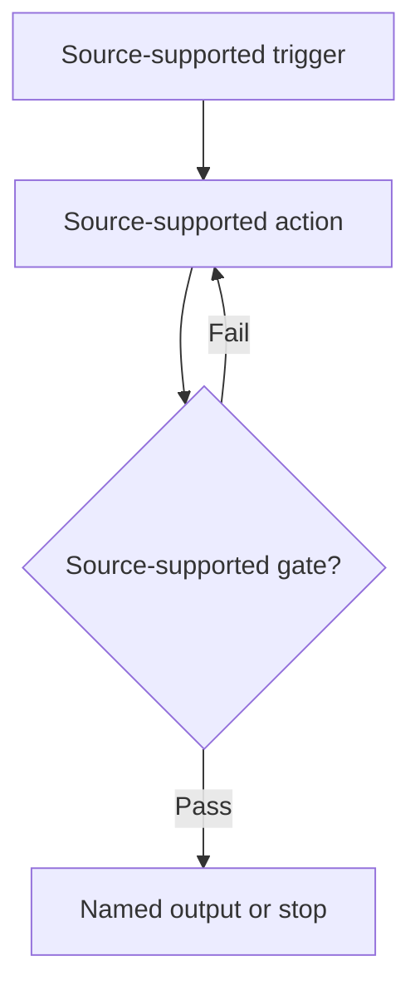

# Pipeline title

> Copy this file to `pipeline-<group-name>-<name>.md`. Remove all instructional text before
> publication.

| Evidence capsule | Value |
| --- | --- |
| Scope | End-to-end, discipline, asset, verification, tuning, technical graphics, or delivery |
| Trigger | The source-supported condition that starts this workflow |
| Source | Direct link to the primary source at a frozen revision |
| Author and evidence date | Traceable author; source date and retrieval date |
| Evidence signals | One or more separate vocabulary labels from the index |
| Evidence limit | What admission does not establish |

## Loop

Use one top-level Mermaid path with at most nine main nodes. Preserve source order, branches,
feedback, and stop conditions. Mark any necessary editorial inference as `Inference:` inside its
node or edge label and again in the prose.

## Run the loop

State the ordered actions, required inputs, artifacts, responsible roles when the source names
them, and the feedback path. Keep source facts and source-specific details distinct from inference.

## Outputs and stop conditions

Name the produced artifacts, acceptance gate, rejection or deferral path, and repeat condition.

## Supporting skills

**Observed:** List only skills or tools the source names or uses.

**Potential:** List portable capabilities inferred by this library. Label them as inference; they
may not exist.

## Evidence boundaries

State source-specific constraints, contradictions, portability limits, effectiveness limits, and
license or reuse constraints that affect what the reader may copy or run.

## Sources

Use direct links to primary artifacts. Keep deep provenance and the complete source-to-diagram
mapping in the target's research outcome.
