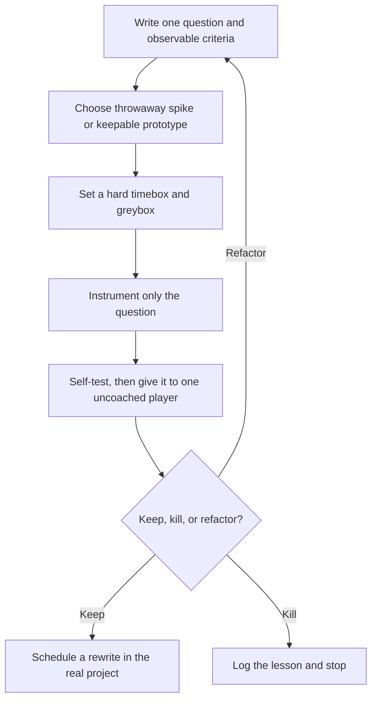

# Fast gameplay prototyping

| Evidence capsule | Value |
| --- | --- |
| Scope | Prototyping |
| Trigger | One mechanic or playable idea needs a quick keep, kill, or refactor decision |
| Source | [`prototype-fast` at revision `9ca5296`](https://github.com/gamedev-skills/awesome-gamedev-agent-skills/blob/9ca5296b219049c5b68494e1f3c274ead6d727b3/skills/workflows/prototype-fast/SKILL.md) |
| Author and evidence date | Abhishek Barali; last path change 2026-08-08; retrieved 2026-08-17 |
| Evidence signals | Source-documented |
| Evidence limit | The repository supplies instructions and examples, not a completed prototype, playtest record, or effectiveness study |

## Loop

## Run the loop

1. Write one answerable gameplay question. Fill in a brief with the core verb, the timebox, the
   throwaway decision, and observable keep and kill criteria.
2. Isolate the prototype from the shipping project. Greybox everything the question does not need.
3. Add only the measurements or debug display needed to judge the mechanic.
4. Play it yourself, then observe one player who receives no control explanation.
5. Apply the prewritten criteria. A keep decision authorizes a rewrite, not promotion of spike
   code. A kill decision produces a recorded lesson. A refactor decision narrows the question and
   begins another spike.

## Outputs and stop conditions

The outputs are a prototype brief, an isolated greybox build, question-specific observations, and
one recorded decision. Stop when the timebox expires even if the prototype is unfinished. Kill and
log the result when the criteria fail; rewrite in the real project only after a keep decision.

## Supporting skills

**Observed:** The source routes timed competitions to `game-jam` and the greybox implementation to
the relevant engine-core and genre skills.

**Potential:** Playtest observation capture, prototype telemetry, and decision-log maintenance are
capabilities inferred by this library. They may not exist as installed skills.

## Evidence boundaries

- The loop is an agent instruction in one skill file. The repository contains no linked prototype,
  timer record, outside-player observation, or keep/kill decision produced with it.
- The approximate time ranges and example criteria are source guidance, not measured guarantees.
- Repository validation checks skill structure and links. It does not test whether a mechanic is
  fun or whether this loop improves a development outcome.
- The source is Apache-2.0. A prototype's engine, code, and assets keep their own license terms.

## Sources

- [Trigger, boundary, and seven-step workflow](https://github.com/gamedev-skills/awesome-gamedev-agent-skills/blob/9ca5296b219049c5b68494e1f3c274ead6d727b3/skills/workflows/prototype-fast/SKILL.md#L11-L45)
- [Prototype brief and observable decision criteria](https://github.com/gamedev-skills/awesome-gamedev-agent-skills/blob/9ca5296b219049c5b68494e1f3c274ead6d727b3/skills/workflows/prototype-fast/SKILL.md#L47-L83)
- [Spike containment and rewrite rule](https://github.com/gamedev-skills/awesome-gamedev-agent-skills/blob/9ca5296b219049c5b68494e1f3c274ead6d727b3/skills/workflows/prototype-fast/SKILL.md#L85-L108)
- [Goal 02 source audit and diagram mapping](research/07-gamedev-skills-harvest.md#fast-gameplay-prototyping-diagram-mapping)
