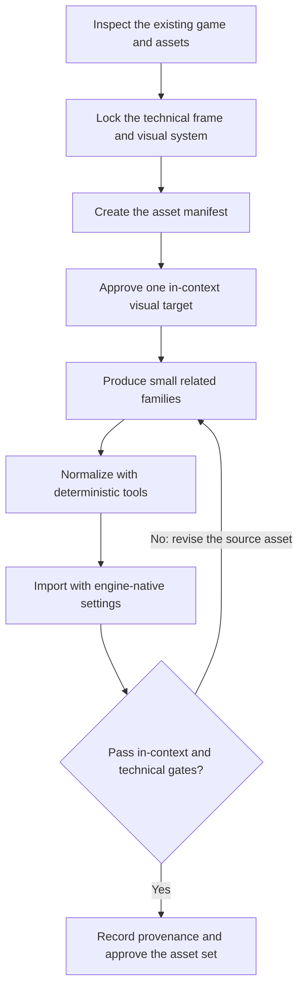

# Game-asset production

| Evidence capsule | Value |
| --- | --- |
| Scope | Asset |
| Trigger | A game needs a cohesive, engine-ready family of visual assets or a controlled asset revision |
| Source | [`create-game-assets` at revision `9ca5296`](https://github.com/gamedev-skills/awesome-gamedev-agent-skills/blob/9ca5296b219049c5b68494e1f3c274ead6d727b3/skills/disciplines/create-game-assets/SKILL.md) |
| Author and evidence date | Ishan Gautam; 2026-08-08; retrieved 2026-08-17 |
| Evidence signals | Source-documented |
| Evidence limit | Bundled templates, scripts, and tests establish artifacts and deterministic raster checks, not the quality or production use of a completed asset set |

## Loop

## Run the loop

1. Inspect the game's current visual and technical state. Record camera, scale, target platforms,
   dimensions, palette, material, lighting, motion, budgets, paths, and naming in an art-direction
   brief.
2. Build a manifest that separates production assets from greybox placeholders and records each
   asset's technical contract, source, license, status, and approval evidence.
3. Approve one representative target at native game scale and against a gameplay background before
   producing a family.
4. Produce related assets in small batches from the approved reference. Normalize dimensions,
   alpha, crop, anchor, slices, naming, compression, topology, or pivots with deterministic tools.
5. Import with the target engine's settings. Inspect contact sheets and the real game for cohesion,
   gameplay read, technical fit, seams, animation, collision, memory, and compression.
6. If a gate fails, revise the source asset and repeat production—not only a runtime compensation.
   Record provenance and approval after the relevant gates pass.

## Outputs and stop conditions

The outputs are an art-direction brief, asset manifest, approved visual target, normalized source
and runtime assets, QA reports or contact sheets where applicable, in-game captures, and provenance
records. Stop with an explicit brief and placeholders when no permitted creation or source path is
available. Do not approve an asset from a generated preview alone.

## Supporting skills

**Observed:** The source names an installed `imagegen` skill when available, bundled raster-report
and preview-sheet scripts, engine import/rendering skills, `game-ui-ux`, `game-feel`,
`shader-programming`, and `audio-design`.

**Potential:** Visual-review facilitation, DCC cleanup, license snapshotting, engine-import QA, and
asset-budget regression checks are capabilities inferred by this library. They may not exist as
installed skills.

## Evidence boundaries

- The source includes a brief, JSON manifest, two deterministic raster helpers, and tests that can
  pass and fail size/alpha/color constraints. Those checks do not judge art direction or gameplay
  readability.
- No completed asset family, engine project, approval record, or outside production use is linked.
- Image, model, font, marketplace, engine, and generation-service terms remain separate from the
  repository's Apache-2.0 license. The manifest's rights gate still requires source-specific terms.
- AI generation is optional in the source. This is an agent-operated asset workflow, not evidence
  that generated output is shippable.

## Sources

- [Ten-step asset workflow and production-path branches](https://github.com/gamedev-skills/awesome-gamedev-agent-skills/blob/9ca5296b219049c5b68494e1f3c274ead6d727b3/skills/disciplines/create-game-assets/SKILL.md#L8-L55)
- [Deterministic raster checks and quality gates](https://github.com/gamedev-skills/awesome-gamedev-agent-skills/blob/9ca5296b219049c5b68494e1f3c274ead6d727b3/skills/disciplines/create-game-assets/SKILL.md#L80-L117)
- [Copyable art-direction brief](https://github.com/gamedev-skills/awesome-gamedev-agent-skills/blob/9ca5296b219049c5b68494e1f3c274ead6d727b3/skills/disciplines/create-game-assets/assets/art-direction-brief.md)
- [Asset manifest contract](https://github.com/gamedev-skills/awesome-gamedev-agent-skills/blob/9ca5296b219049c5b68494e1f3c274ead6d727b3/skills/disciplines/create-game-assets/assets/asset-manifest.json)
- [Goal 02 source audit and diagram mapping](../objectives/skill-process/research/07-gamedev-skills-harvest.md#game-asset-production-diagram-mapping)
