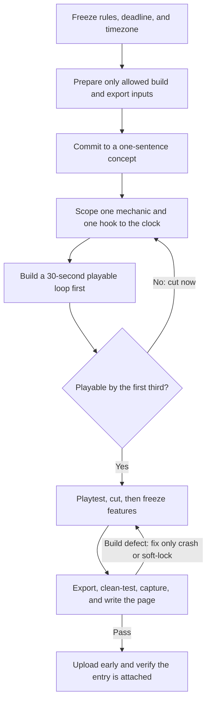

# Game-jam delivery

| Evidence capsule | Value |
| --- | --- |
| Scope | Delivery |
| Trigger | A fixed game-jam deadline and theme must become a playable, submitted entry |
| Source | [`game-jam` at revision `9ca5296`](https://github.com/gamedev-skills/awesome-gamedev-agent-skills/blob/9ca5296b219049c5b68494e1f3c274ead6d727b3/skills/workflows/game-jam/SKILL.md) |
| Author and evidence date | Abhishek Barali; last path change 2026-08-08; retrieved 2026-08-17 |
| Evidence signals | Source-documented |
| Evidence limit | No jam entry, timestamp trail, clean-build result, or postmortem is linked to this playbook |

## Loop

## Run the loop

1. Record the jam's rules, theme time, deadline and timezone, team and asset rules, and rating
   obligations. Prepare a known export path and licensed inputs only where the rules allow it.
2. Turn the theme into one sentence. Fit one core mechanic and one hook to the remaining clock.
3. Build the complete start-to-play-to-result-to-restart loop with placeholders before content and
   polish. If it is not playable by the first third of the jam, cut scope immediately.
4. Playtest with another person, cut what does not land, add the bounded presentation pass, and
   enter a no-new-features freeze.
5. Reserve the shipping buffer for crash and soft-lock fixes, export, a clean-path build test,
   captures, credits, and the submission page. Upload early and confirm the file is attached to the
   jam, not only to a project page.

## Outputs and stop conditions

The outputs are the one-sentence concept, a scoped playable loop, a clean-tested export, submission
media and credits, and a verified jam entry. The deadline is the hard stop. During the shipping
buffer, reject new features and fix only failures that block a playable submission.

## Supporting skills

**Observed:** `prototype-fast`, `itch-publish`, engine-core skills, and genre skills are named as
handoffs in the source.

**Potential:** Rule capture, scope-budget tracking, external playtest notes, clean-build smoke
testing, and submission verification are capabilities inferred by this library. They may not exist
as installed skills.

## Evidence boundaries

- The source provides a planning playbook and illustrative 48-hour schedule. It does not link a jam
  repository, submission, timestamps, or postmortem that applies the loop.
- Time blocks and feature counts are author guidance, not observed performance or delivery rates.
- Structural repository tests do not build a game, test an export, or submit an entry.
- The Apache-2.0 license covers the playbook. Jam rules, engines, fonts, audio, and other assets
  retain separate terms.

## Sources

- [Trigger, boundaries, and seven-step delivery flow](https://github.com/gamedev-skills/awesome-gamedev-agent-skills/blob/9ca5296b219049c5b68494e1f3c274ead6d727b3/skills/workflows/game-jam/SKILL.md#L11-L47)
- [Scope budget, 48-hour sequence, and feature triage](https://github.com/gamedev-skills/awesome-gamedev-agent-skills/blob/9ca5296b219049c5b68494e1f3c274ead6d727b3/skills/workflows/game-jam/SKILL.md#L49-L84)
- [Clean-build and submission gate](https://github.com/gamedev-skills/awesome-gamedev-agent-skills/blob/9ca5296b219049c5b68494e1f3c274ead6d727b3/skills/workflows/game-jam/SKILL.md#L86-L110)
- [Goal 02 source audit and diagram mapping](research/07-gamedev-skills-harvest.md#game-jam-delivery-diagram-mapping)
