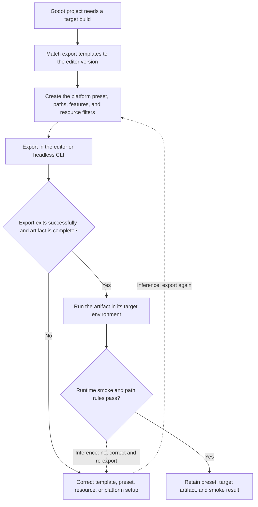

# Godot export and runtime validation

| Evidence capsule | Value |
| --- | --- |
| Scope | Engine-specific export and runtime verification |
| Trigger | A Godot 4.7 project needs a distributable desktop, web, mobile, or dedicated-server build |
| Source | [`godot-export` at revision `9ca5296`](https://github.com/gamedev-skills/awesome-gamedev-agent-skills/blob/9ca5296b219049c5b68494e1f3c274ead6d727b3/skills/godot/godot-export/SKILL.md) |
| Author and evidence date | Introduced by AbhishekBarali1 and last changed by Ishan Gautam on 2026-08-08; retrieved 2026-08-17 |
| Evidence signals | Source-documented |
| Evidence limit | An agent skill and preset/CLI reference state the workflow; no named exported game or independent result validates it |

## Loop

## Run the loop

1. Install export templates whose version matches the editor exactly. Create a named platform preset
   with output path, icons, features, and include/exclude filters in `export_presets.cfg`.
2. Satisfy the selected platform branch: web hosting and cross-origin isolation when threads require
   it, Android SDK and keystore, or Apple signing/notarization. Keep secrets out of a public preset.
3. Export from the editor or run the exact preset name with `--export-release` in headless CI. Check
   the process exit and the expected executable, HTML/wasm/PCK, app, or server artifact.
4. Run the artifact on its target path. Serve web output over HTTP(S), verify packaged resource
   filters, and confirm runtime writes use `user://` rather than read-only `res://`.
5. The two dotted return connectors are **editorial inference**. The source names export/runtime
   gates and their concrete failure causes, but it does not state a literal re-export arrow.

## Outputs and stop conditions

Outputs are version-matched templates, committed non-secret preset configuration, platform setup,
export log and exit status, target artifact, and runtime-smoke result. Stop when prerequisites are
missing, the export fails, required resources are absent, web isolation or signing blocks the target,
or the artifact violates exported path rules. A passing target build hands off to a separate
storefront or hosting workflow.

## Supporting skills

**Observed:** Godot export templates, Project Export presets, `export_presets.cfg`, headless CLI,
release/debug/PCK exports, feature tags, web COOP/COEP headers, Android SDK/keystores, Apple signing,
`res://`, and `user://`.

**Potential (inference):** Template-version audit, secret-safe preset review, platform-prerequisite
checks, exported-resource inspection, target smoke-test authoring, and artifact identity recording.
These capabilities may not exist as reusable skills.

## Evidence boundaries

- The source targets Godot 4.7. Template delivery, CLI flags, platform exports, web requirements,
  signing, and SDK setup are mutable and need current official verification before execution.
- The retry connectors are inference. The source directly supports the ordered export, failure
  conditions, and target smoke gate.
- The repository is Apache-2.0; the license does not cover Godot, platform SDKs, signing identities,
  hosting services, a game project, or its exported assets.
- An exported artifact that launches is not evidence of gameplay quality, performance,
  certification, distribution readiness, or production use.

## Sources

- [Six-step Godot export and smoke workflow](https://github.com/gamedev-skills/awesome-gamedev-agent-skills/blob/9ca5296b219049c5b68494e1f3c274ead6d727b3/skills/godot/godot-export/SKILL.md#L25-L39)
- [Headless export and headless-run patterns](https://github.com/gamedev-skills/awesome-gamedev-agent-skills/blob/9ca5296b219049c5b68494e1f3c274ead6d727b3/skills/godot/godot-export/SKILL.md#L41-L89)
- [Export and platform failure conditions](https://github.com/gamedev-skills/awesome-gamedev-agent-skills/blob/9ca5296b219049c5b68494e1f3c274ead6d727b3/skills/godot/godot-export/SKILL.md#L91-L111)
- [Preset structure, CLI exit, and platform branches](https://github.com/gamedev-skills/awesome-gamedev-agent-skills/blob/9ca5296b219049c5b68494e1f3c274ead6d727b3/skills/godot/godot-export/references/presets-and-cli.md#L5-L97)
- [Frozen Apache-2.0 license](https://github.com/gamedev-skills/awesome-gamedev-agent-skills/blob/9ca5296b219049c5b68494e1f3c274ead6d727b3/LICENSE)
- [Goal 80 source audit and diagram mapping](../objectives/skill-process/research/13-deferred-pipeline-follow-up.md#godot-export-and-runtime-diagram-mapping)
