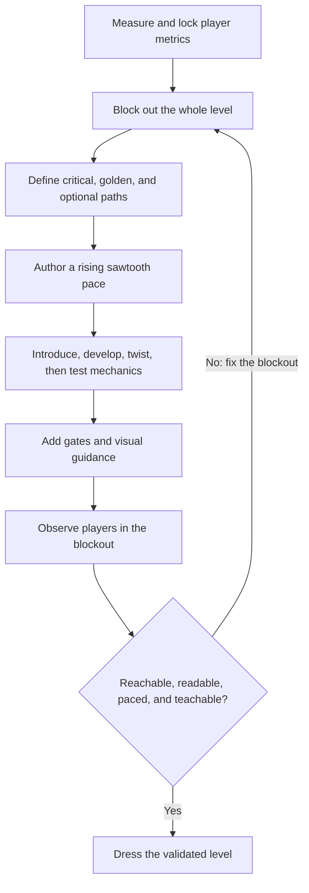

# Level blockout, teach, and test

| Evidence capsule | Value |
| --- | --- |
| Scope | Discipline |
| Trigger | A playable level must be sized, structured, taught, and tested before art dressing |
| Source | [`level-design` at revision `9ca5296`](https://github.com/gamedev-skills/awesome-gamedev-agent-skills/blob/9ca5296b219049c5b68494e1f3c274ead6d727b3/skills/disciplines/level-design/SKILL.md) |
| Author and evidence date | Abhishek Barali; last path change 2026-08-08; retrieved 2026-08-17 |
| Evidence signals | Source-documented |
| Evidence limit | The repository supplies a method and illustrative data, not a level, player study, traversal record, or production result |

## Loop

## Run the loop

1. Measure movement, reach, and camera limits. Size required geometry from those metrics before
   placing detail.
2. Build the full level from untextured primitives. Define a solvable critical path, the expected
   golden path, and bounded optional branches.
3. Record the intended tension curve. Alternate rising challenges with rests, including a breather
   before major peaks.
4. Teach each mechanic in an introduce, develop, twist, and pressure-test sequence. Add order gates
   and guide attention with light, lines, landmarks, color, and framing.
5. Watch players traverse the blockout. Check metrics, key and ability order, pacing, teaching,
   guidance, optional-route rejoining, and soft locks. Repair the blockout and repeat until it plays
   well; only then add art dressing.

## Outputs and stop conditions

The outputs are locked player metrics, an undressed playable blockout, critical and golden path
data, a pacing curve, teaching beats, gate order, playtest observations, and a validated level ready
for dressing. Do not proceed to art while traversal, readability, pacing, teaching, or soft-lock
checks fail.

## Supporting skills

**Observed:** The source names engine movement skills, `input-systems`, `godot-tilemap`,
`unity-tilemap-2d`, `procedural-gen`, `game-ai`, and the `platformer`, `puzzle`, and `roguelike`
genre skills.

**Potential:** Movement-metric capture, path-solvability checks, pacing visualization, playtest
observation capture, and soft-lock regression tests are capabilities inferred by this library. They
may not exist as installed skills.

## Evidence boundaries

- Example movement constants, pacing beats, and room graphs are illustrative source data, not
  measurements from a named project.
- The source requires real-player observation but links no participant record or resulting level.
- Repository structural tests do not traverse a level, validate a teaching sequence, or detect a
  production soft lock.
- The playbook is Apache-2.0. Engine projects and art used to dress the blockout retain their own
  terms.

## Sources

- [Scope and seven-step level workflow](https://github.com/gamedev-skills/awesome-gamedev-agent-skills/blob/9ca5296b219049c5b68494e1f3c274ead6d727b3/skills/disciplines/level-design/SKILL.md#L13-L52)
- [Metrics, pacing, and path-validation artifacts](https://github.com/gamedev-skills/awesome-gamedev-agent-skills/blob/9ca5296b219049c5b68494e1f3c274ead6d727b3/skills/disciplines/level-design/SKILL.md#L54-L105)
- [Teaching loop, guidance, and blockout review gate](https://github.com/gamedev-skills/awesome-gamedev-agent-skills/blob/9ca5296b219049c5b68494e1f3c274ead6d727b3/skills/disciplines/level-design/references/pacing-and-flow.md#L21-L93)
- [Goal 02 source audit and diagram mapping](../objectives/skill-process/research/07-gamedev-skills-harvest.md#level-blockout-teach-and-test-diagram-mapping)
