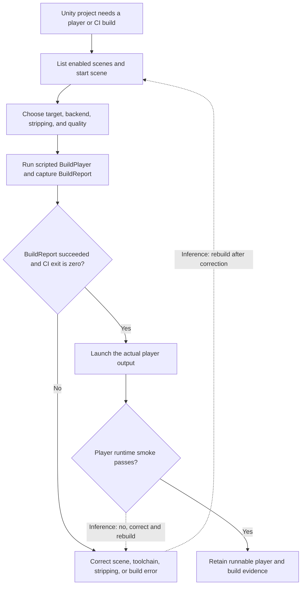

# Unity build and runtime validation

| Evidence capsule | Value |
| --- | --- |
| Scope | Engine-specific build and runtime verification |
| Trigger | A Unity 6.3 LTS project needs a repeatable player build or Unity-side CI build |
| Source | [`unity-build-pipeline` at revision `9ca5296`](https://github.com/gamedev-skills/awesome-gamedev-agent-skills/blob/9ca5296b219049c5b68494e1f3c274ead6d727b3/skills/unity/unity-build-pipeline/SKILL.md) |
| Author and evidence date | Introduced by Abhishek Barali and last changed by Ishan Gautam on 2026-08-08; retrieved 2026-08-17 |
| Evidence signals | Source-documented |
| Evidence limit | An agent skill and code sample state the workflow; no named built game, CI run, or independent outcome validates it |

## Loop

## Run the loop

1. List only enabled scenes and confirm scene zero is the intended start scene. Choose the platform
   target, then select Mono or IL2CPP with its required platform toolchain.
2. Set managed stripping, protect reflection-only types with `link.xml`, and apply platform quality
   settings. Addressables, when present, need a separate content build before the player.
3. Call `BuildPipeline.BuildPlayer` with explicit scenes, output, target, and build options. Inspect
   `BuildReport.summary.result`; returning from the API or logging an error is not success.
4. In CI, invoke the method in batch mode and propagate an explicit nonzero editor exit on failure.
   Preserve the build log, report result, size, duration, output path, target, and version.
5. Launch the produced player. Do not accept a build merely because the editor-side call completed.
   The two dotted return connectors are **editorial inference**: the source names the failure classes
   and requires both gates, but does not draw a literal rebuild arrow after correction.

## Outputs and stop conditions

Outputs are the scene manifest, platform/backend/stripping decisions, build script, `BuildReport`, CI
log and exit status, player artifact, and runtime-smoke result. Do not proceed as successful when a
platform module or IL2CPP toolchain is absent, `BuildReport` is not `Succeeded`, the editor returns a
failure exit, Addressables content is stale, or the actual player does not run. The runnable player is
the handoff to a separate distribution pipeline.

## Supporting skills

**Observed:** Unity Editor build profiles/settings, `EditorBuildSettings`, `BuildPipeline.BuildPlayer`,
`BuildReport`, `EditorApplication.Exit`, batch mode, Mono, IL2CPP, managed stripping, `link.xml`, and
Addressables content build.

**Potential (inference):** Build-manifest review, platform-prerequisite audit, player smoke-test
authoring, log triage, and artifact identity recording. These capabilities may not exist as reusable
skills.

## Evidence boundaries

- The source targets Unity 6.3 LTS (`6000.3`). APIs, platform modules, licensing, certification,
  command-line behavior, and build requirements can change and need current official verification.
- The retry connectors are inference, not source-authored control flow. The source directly supports
  the ordered build and two acceptance gates plus concrete failure classes.
- The repository is Apache-2.0; that license does not cover Unity, platform SDKs/toolchains, a game
  project, packages, or built content.
- A launch smoke test does not prove gameplay quality, performance, platform certification, store
  readiness, or production use.

## Sources

- [Seven-step Unity build and runtime workflow](https://github.com/gamedev-skills/awesome-gamedev-agent-skills/blob/9ca5296b219049c5b68494e1f3c274ead6d727b3/skills/unity/unity-build-pipeline/SKILL.md#L27-L42)
- [Build-report result check and CI invocation](https://github.com/gamedev-skills/awesome-gamedev-agent-skills/blob/9ca5296b219049c5b68494e1f3c274ead6d727b3/skills/unity/unity-build-pipeline/SKILL.md#L46-L84)
- [Failure classes and Addressables boundary](https://github.com/gamedev-skills/awesome-gamedev-agent-skills/blob/9ca5296b219049c5b68494e1f3c274ead6d727b3/skills/unity/unity-build-pipeline/SKILL.md#L95-L109)
- [Parameterized CI script and explicit exit contract](https://github.com/gamedev-skills/awesome-gamedev-agent-skills/blob/9ca5296b219049c5b68494e1f3c274ead6d727b3/skills/unity/unity-build-pipeline/references/ci-build-script.md#L7-L92)
- [Frozen Apache-2.0 license](https://github.com/gamedev-skills/awesome-gamedev-agent-skills/blob/9ca5296b219049c5b68494e1f3c274ead6d727b3/LICENSE)
- [Goal 80 source audit and diagram mapping](../objectives/skill-process/research/13-deferred-pipeline-follow-up.md#unity-build-and-runtime-diagram-mapping)
