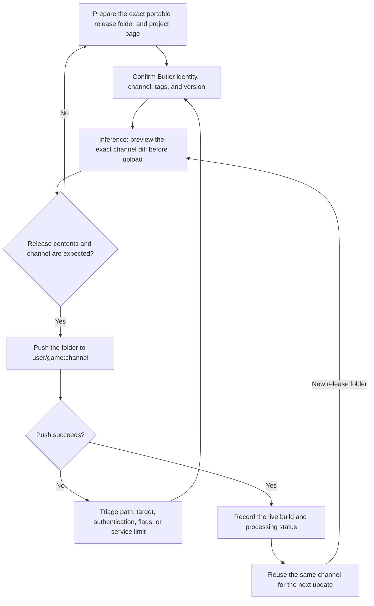

# itch.io Butler publish and update

| Evidence capsule | Value |
| --- | --- |
| Scope | Storefront delivery and update |
| Trigger | A portable game build and existing itch.io project page need a first upload or update |
| Source | The frozen [Butler manual source](https://github.com/itchio/butler/blob/0c9a730a9305fc9d23724e28ce0e4a5b01d048ee/docs/pushing.md) plus the frozen [`itch-publish` agent skill](https://github.com/gamedev-skills/awesome-gamedev-agent-skills/blob/9ca5296b219049c5b68494e1f3c274ead6d727b3/skills/workflows/itch-publish/SKILL.md) |
| Author and evidence date | itch.io/leaf corcoran; agent skill by Abhishek Barali, last changed by Ishan Gautam; sources retrieved 2026-08-17 |
| Evidence signals | Source-documented |
| Evidence limit | The sources document commands and service behavior but link no named agent-run release, playtest, or independent outcome. |

## Loop

## Run the loop

1. Create the itch.io project page, choose Downloadable or HTML, and prepare the exact portable
   release folder a player receives. Do not use an installer or an opaque archive-of-archives.
2. Confirm Butler runs and is authorized, then choose the lowercase `user/game:channel`, initial
   platform/HTML tags, and optional user version. CI may use a protected `BUTLER_API_KEY`.
3. **Inference:** promote the manual's optional `push-preview` command into a pre-upload review gate.
   Compare NEW, MODIFIED, DELETED, and SAME entries; fix the release folder or channel when the diff
   is unexpected. The source documents the preview, but does not require this approval timing.
4. Run `butler push <folder> <user>/<game>:<channel>`. On an error, use the manual's path, target,
   authentication, flag, and size-limit diagnostics, then retry without changing channel identity by
   accident.
5. Record the resulting build/version and channel status. The default patch is live when upload
   finishes; backend optimization continues without blocking players. Push later release folders to
   the same channel to form the update loop.

## Outputs and stop conditions

Outputs are the exact release folder, itch.io page and channel identity, optional version, preview
classification, push result, live build, and processing status. Stop before upload if the preview is
unexpected; stop and troubleshoot on a failed push. A successful upload stops this delivery loop but
does not prove the downloaded game runs. Runtime testing remains an upstream build gate.

## Supporting skills

**Observed:** The sources name `butler version`, login or `BUTLER_API_KEY`, `push-preview`,
`butler push`, `butler status`, project-page editing, channel tags, user versions, hidden first
channels, and the `steam-publish` and `game-jam` handoffs.

**Potential (inference):** portable-release inspection, upload-diff approval, channel registry,
credential hygiene, post-upload download smoke testing, and release-record maintenance. These may not
exist as reusable skills.

## Evidence boundaries

- The frozen Butler repository and its documentation source are MIT licensed. That does not license
  uploaded games, third-party assets, itch.io accounts, or hosted-service behavior. The frozen agent
  wrapper is Apache-2.0 under its own repository.
- The live manual matched the frozen push, preview, processing, channel, version, and current 30 GB
  uncompressed-limit descriptions on 2026-08-17. Service limits and page controls remain mutable.
- `--hidden` applies only when creating a channel. HTML games need both the page kind and channel tag.
  Preview hashing can cost roughly as much as the diff phase of a push.
- The diagram's pre-upload use of `push-preview` is an explicitly labeled editorial inference. Upload
  success and backend processing do not establish runtime quality or player-visible correctness.

## Sources

- [Frozen push order, channel behavior, processing, and status](https://github.com/itchio/butler/blob/0c9a730a9305fc9d23724e28ce0e4a5b01d048ee/docs/pushing.md#L2-L104)
- [Frozen preview classifications and accepted flags](https://github.com/itchio/butler/blob/0c9a730a9305fc9d23724e28ce0e4a5b01d048ee/docs/pushing.md#L186-L229)
- [Frozen login and CI identity handling](https://github.com/itchio/butler/blob/0c9a730a9305fc9d23724e28ce0e4a5b01d048ee/docs/login.md#L2-L54)
- [Frozen troubleshooting paths](https://github.com/itchio/butler/blob/0c9a730a9305fc9d23724e28ce0e4a5b01d048ee/docs/troubleshooting.md)
- [Frozen agent workflow and update loop](https://github.com/gamedev-skills/awesome-gamedev-agent-skills/blob/9ca5296b219049c5b68494e1f3c274ead6d727b3/skills/workflows/itch-publish/SKILL.md#L29-L51)
- [Live pushing manual refreshed on 2026-08-17](https://itch.io/docs/butler/pushing.html)
- [Frozen Butler MIT license](https://github.com/itchio/butler/blob/0c9a730a9305fc9d23724e28ce0e4a5b01d048ee/LICENSE)
- [Goal 04 source audit and diagram mapping](research/09-recursive-wave-01-outcome.md#itchio-butler-publish-and-update-diagram-mapping)
