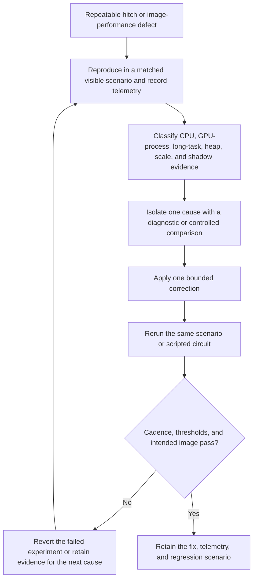

# Pearl Sea Park measured performance recovery

| Evidence capsule | Value |
| --- | --- |
| Scope | Performance diagnosis and recovery |
| Trigger | A repeatable hitch, freeze, frame-cadence problem, or coupled image/performance defect appears during play |
| Source | [`Pearl-Sea-Park` at revision `888fc57`](https://github.com/scottstts/Pearl-Sea-Park/tree/888fc57b817514049b5fb33b0a3e115b585de067) |
| Author and evidence date | Scott Sun; practiced records dated 2026-07-10 through 2026-07-14; source revised 2026-07-25 and retrieved 2026-08-17 |
| Evidence signals | Source-documented; Author-practiced |
| Evidence limit | Measurements and fixes come from one browser game and its author's hardware/context; admission does not prove general performance gains or current browser behavior |

## Loop

## Run the loop

1. Reproduce the problem in a visible tab or a controlled scripted route. First exclude harness
   artifacts such as hidden-tab animation throttling, zero-size buffers, stale auto-quality state,
   or measurement probes that allocate their own apparent garbage.
2. Record presentation cadence separately from CPU submission time. Use retained hitch records to
   compare frame interval, CPU time, long tasks, heap change, render-scale steps, and static or
   dynamic shadow work; enable asynchronous GPU timestamps only for diagnosis.
3. Isolate a cause before changing it. The project used pass toggles, still-camera comparisons,
   pipeline-creation probes, allocation checks, scheduled-event timing, and matched views to reject
   several plausible but wrong explanations.
4. Make one bounded change that preserves the intended image and system ownership. The practiced
   changes include staged shader warmup, stable light topology, staggered texture updates, released
   CPU geometry arrays, reduced synchronous persistence, and removal of an unnecessary nested render.
5. Repeat the same scenario. Retain measured corrections; revert warmup, padding, full-frame noise,
   or reduced-resolution experiments when the failure remains or image quality regresses. Continue
   from fresh evidence rather than optimizing the next guessed bottleneck.

## Outputs and stop conditions

The loop produces a reproducible scenario, telemetry snapshot and hitch records, cause attribution,
retained or reverted experiment record, measured before/after result, and regression route. Stop a
change when the intended visual contract degrades or the same-condition measurement does not improve.
Stop successfully when the reproduced defect clears under the named threshold and the intended image
is unchanged; keep residual causes named instead of hiding them behind a generic FPS claim.

## Supporting skills

**Observed:** Browser runtime inspection, Three.js/WebGPU pipeline probes, pass isolation, scripted
park circuits, `canvas.dataset.performance`, `FramePerformanceMonitor`, long-task and heap sampling,
GPU timestamps, dynamic-resolution state, and static/dynamic shadow counters.

**Potential (inference):** Reproduction-scenario authoring, hitch triage, controlled performance
experimentation, image-equivalence gating, and before/after report design. These capabilities may not
exist as reusable skills.

## Evidence boundaries

- The source's thresholds, timings, shader behavior, and browser/driver causes are contextual and can
  drift. They are evidence of the loop, not portable budgets.
- Some early measurements were invalidated by their own probes or hidden-tab state. This page retains
  those contradictions because environment validation is part of the practiced method.
- The source reverted experiments that did not survive the matched comparison. Repository activity
  and a final successful circuit do not establish independent validation or production use.
- No license file exists at the frozen revision; citation does not authorize reuse of code or assets.

## Sources

- [Measured image/performance path and telemetry contract](https://github.com/scottstts/Pearl-Sea-Park/blob/888fc57b817514049b5fb33b0a3e115b585de067/dev_docs/systems/opening-day.md#L70-L110)
- [Instrument-first freeze diagnosis and verified warmup result](https://github.com/scottstts/Pearl-Sea-Park/blob/888fc57b817514049b5fb33b0a3e115b585de067/dev_docs/notes.md#L897-L935)
- [Residual-hitch attribution and harness warning](https://github.com/scottstts/Pearl-Sea-Park/blob/888fc57b817514049b5fb33b0a3e115b585de067/dev_docs/notes.md#L936-L953)
- [Reproduced causes, reverted experiments, and scripted-circuit result](https://github.com/scottstts/Pearl-Sea-Park/blob/888fc57b817514049b5fb33b0a3e115b585de067/dev_docs/notes.md#L1117-L1176)
- [Retained hitch-record implementation](https://github.com/scottstts/Pearl-Sea-Park/blob/888fc57b817514049b5fb33b0a3e115b585de067/src/render/performanceMonitor.ts#L19-L129)
- [Goal 80 source audit and diagram mapping](../objectives/skill-process/research/13-deferred-pipeline-follow-up.md#sea-park-performance-diagram-mapping)
