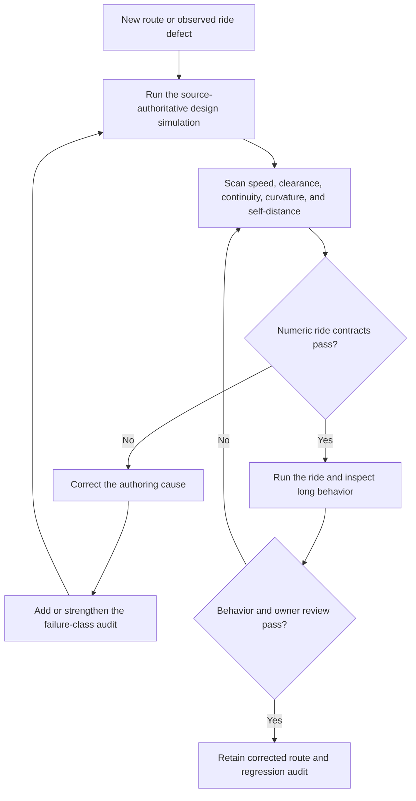

# Pearl Sea Park simulation-first ride geometry correction

| Evidence capsule | Value |
| --- | --- |
| Scope | Technical gameplay geometry and ride verification |
| Trigger | A new ride route or an observed ride defect needs a correction that preserves physical behavior and world clearance |
| Source | [`Pearl-Sea-Park` at revision `888fc57`](https://github.com/scottstts/Pearl-Sea-Park/tree/888fc57b817514049b5fb33b0a3e115b585de067) |
| Author and evidence date | Scott Sun; practiced records dated 2026-07-10 through 2026-07-14; source revised 2026-07-25 and retrieved 2026-08-17 |
| Evidence signals | Source-documented; Author-practiced |
| Evidence limit | One author-owned Three.js game demonstrates project-specific ride corrections; no independent evidence establishes transferability or effectiveness elsewhere |

## Loop

## Run the loop

1. Start from an authored route or a concrete sighting such as a cabin intersecting a dome, a track
   knot, a stall, a crawl, or a rotating member piercing its vehicle. Keep the route, terrain, ride
   dynamics, and vehicle envelope under named authorities rather than parallel estimates.
2. Run the design pass with the same integrator used by the ride. Print the speed profile and sample
   the actual terrain and route instead of judging pacing or clearance from a single view.
3. Check the applicable numeric contracts: completion, speed bands, track-to-ground clearance, route
   closure continuity, bank and roll rate, turn rate, self-distance, route-to-structure clearance, sampling
   cadence, and exact docking.
4. Correct the authoring cause. The practiced fixes change control-point direction, element phase,
   terrain authority, force-zone placement, or shared dynamics; they do not hide a bad route by
   fudging the runtime physics or increasing sampling density.
5. When a human sighting reveals a numerically detectable failure class, add that class to the audit
   and rerun the source-authoritative simulation. Then exercise the actual ride or long-running
   behavior and return to the numeric scan if owner review finds another defect.

## Outputs and stop conditions

Outputs are the corrected route and dynamics, measured profile, applicable clearance and continuity
records, and an executable regression audit. Do not retain a route while its simulator cannot finish,
its required envelope or pacing threshold fails, or runtime behavior contradicts the measurements.
Stop successfully only when numeric contracts and the ride inspection agree; a new observed failure
reopens the scan and strengthens the audit when the class is measurable.

## Supporting skills

**Observed:** Three.js, Catmull-Rom route authoring, shared design/runtime integration, terrain sampling,
`npm run audit:geometry`, source-specific track and aerial-route audits, fixed views, and owner runtime
inspection.

**Potential (inference):** Route-envelope authoring, simulation-profile reporting, spline-defect
localization, ride-dynamics review, and regression-contract design. These capabilities may not exist
as reusable skills.

## Evidence boundaries

- The source is one evolving game and one author account. Its metrics are contracts for the Pearl's
  routes, terrain, vehicles, and ride rhythm—not universal coaster or cable-transport limits.
- The project-level [staged agent build](pipeline-pearl-sea-park-staged-agent-build.md) includes many
  validation methods. This page preserves the independently triggered ride-route correction loop and
  does not restate the larger stage coordinator.
- The source records both human sightings and numeric gates. A passing audit did not prevent a later
  visible knot; the response was to add curvature and self-distance checks, not to claim complete
  geometric proof.
- No license file exists at the frozen revision. The links support audit and citation, not permission
  to copy code, game content, or assets.

## Sources

- [Shared-integrator, profile, pacing, knot, and audit corrections](https://github.com/scottstts/Pearl-Sea-Park/blob/888fc57b817514049b5fb33b0a3e115b585de067/dev_docs/notes.md#L632-L667)
- [Ride-feel profile and failure-class expansion](https://github.com/scottstts/Pearl-Sea-Park/blob/888fc57b817514049b5fb33b0a3e115b585de067/dev_docs/notes.md#L801-L843)
- [Torrent route, dynamics, measurements, and testing record](https://github.com/scottstts/Pearl-Sea-Park/blob/888fc57b817514049b5fb33b0a3e115b585de067/dev_docs/systems/ride-torrent.md#L3-L47)
- [Torrent numeric contracts and corrected results](https://github.com/scottstts/Pearl-Sea-Park/blob/888fc57b817514049b5fb33b0a3e115b585de067/dev_docs/systems/ride-torrent.md#L102-L168)
- [Owner sighting converted into an aerial-route contract](https://github.com/scottstts/Pearl-Sea-Park/blob/888fc57b817514049b5fb33b0a3e115b585de067/dev_docs/notes.md#L742-L751)
- [Geometry audit runner](https://github.com/scottstts/Pearl-Sea-Park/blob/888fc57b817514049b5fb33b0a3e115b585de067/scripts/audit-geometry.mjs)
- [Goal 80 source audit and diagram mapping](research/13-deferred-pipeline-follow-up.md#sea-park-ride-geometry-diagram-mapping)
