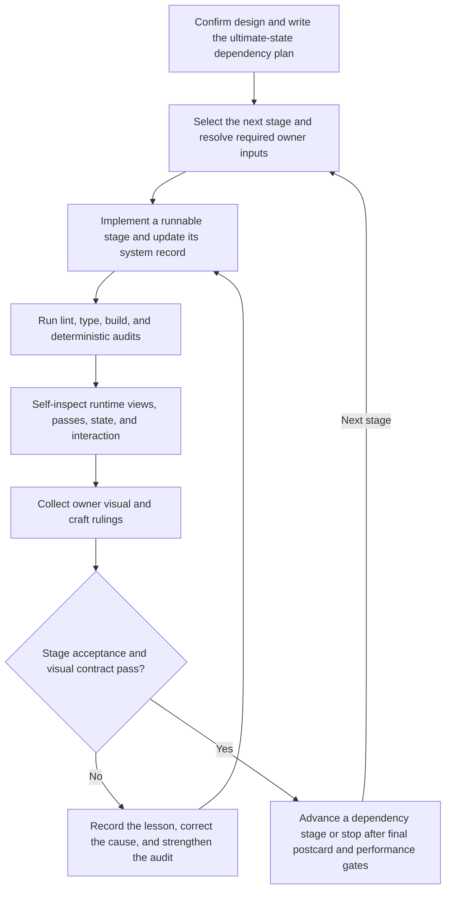

# Pearl Sea Park staged agent build

| Evidence capsule | Value |
| --- | --- |
| Scope | End-to-end, stage-gated construction of a Three.js/WebGPU game |
| Trigger | An owner-approved game design needs to become one runnable, ultimate-state build |
| Source | [`Pearl-Sea-Park` at revision `888fc57`](https://github.com/scottstts/Pearl-Sea-Park/tree/888fc57b817514049b5fb33b0a3e115b585de067) |
| Author and evidence date | Scott Sun; frozen source revised 2026-07-25, retrieved 2026-08-17 |
| Evidence signals | Source-documented; Author-practiced |
| Evidence limit | One author-owned project records the loop. It does not establish independent effectiveness, portability, or a reusable autonomous studio process. |

## Loop

## Run the loop

1. Draft the design, wait for the owner's confirmation and amendments, then write one ultimate-state
   plan whose stages express dependency order rather than feature tiers.
2. Select the next stage and its acceptance condition. Resolve only blocked logistics that the
   source reserves for the owner, such as package approval, supplied assets, and reference hardware.
3. Implement the stage as modular systems while keeping the game runnable. Update the relevant
   `dev_docs/systems/*.md` record and append durable lessons to `dev_docs/notes.md`.
4. Run lint, type checking, the production build, and the applicable deterministic audits. Then use
   fixed `?view=` cameras, `?pass=` diagnostics, `?debug` state, synthetic input, and long-running
   simulations to inspect behavior that structural checks cannot prove.
5. Apply the owner's visual and craft rulings. If a gate fails, diagnose the cause, record the
   correction, and add a numeric or structural audit when the defect class is machine-detectable.
   Repeat the stage; otherwise advance in dependency order.

## Outputs and stop conditions

The loop produces a confirmed design, dependency-ordered plan, runnable stage increments, system
records, an accumulated lesson log, audit results, runtime captures or state observations, and owner
rulings. Stop a stage while required owner logistics are unresolved or any acceptance condition
fails. The project-level stop is the final ten-postcard, runtime, and performance handoff after the
last dependency stage; later owner feedback re-enters the correction loop.

## Supporting skills

**Observed:** The source names Three.js subject and image-effect skills, `threejs-visual-validation`,
Vite, strict TypeScript, ESLint, Three.js/WebGPU/TSL, Rapier, browser preview screenshots, debug views,
synthetic keyboard input, production builds, and custom geometry and GLB audits.

**Potential (inference):** design-confirmation facilitation, dependency-stage planning, acceptance-
gate tracking, owner-feedback capture, deterministic simulation, defect-class regression authoring,
and implementation-memory maintenance. These may not exist as reusable skills.

## Evidence boundaries

- The repository history and notes show the author applying the loop, but all evidence remains
  inside one project and one author account. The live game demonstrates an artifact, not quality or
  causal effectiveness.
- The source's visual checks overlap the existing
  [Three.js visual-system validation](pipeline-threejs-visual-system-validation.md) page. This page
  preserves the larger stage loop and does not restate that validation protocol as a second method.
- Several early plan decisions were later removed by owner ruling. The notes are an evolving memory,
  not a promise that every planned feature shipped.
- No `LICENSE`, `COPYING`, or `NOTICE` file exists at the frozen revision. Citation does not grant
  reuse rights for the source, game, models, audio, or other assets.

## Sources

- [Agent contract and verification rules](https://github.com/scottstts/Pearl-Sea-Park/blob/888fc57b817514049b5fb33b0a3e115b585de067/.codex/AGENTS.md)
- [Confirmed ultimate-state plan and stage gates](https://github.com/scottstts/Pearl-Sea-Park/blob/888fc57b817514049b5fb33b0a3e115b585de067/dev_docs/plan.md#L1-L15)
- [Validation and dependency-ordered build table](https://github.com/scottstts/Pearl-Sea-Park/blob/888fc57b817514049b5fb33b0a3e115b585de067/dev_docs/plan.md#L193-L228)
- [Design confirmation, agent preview, and self-test loop](https://github.com/scottstts/Pearl-Sea-Park/blob/888fc57b817514049b5fb33b0a3e115b585de067/dev_docs/notes.md#L3-L55)
- [Owner feedback converted into a new audit class](https://github.com/scottstts/Pearl-Sea-Park/blob/888fc57b817514049b5fb33b0a3e115b585de067/dev_docs/notes.md#L825-L843)
- [Final postcard and runtime-verification record](https://github.com/scottstts/Pearl-Sea-Park/blob/888fc57b817514049b5fb33b0a3e115b585de067/dev_docs/systems/opening-day.md#L112-L141)
- [Goal 04 source audit and diagram mapping](research/09-recursive-wave-01-outcome.md#pearl-sea-park-diagram-mapping)
