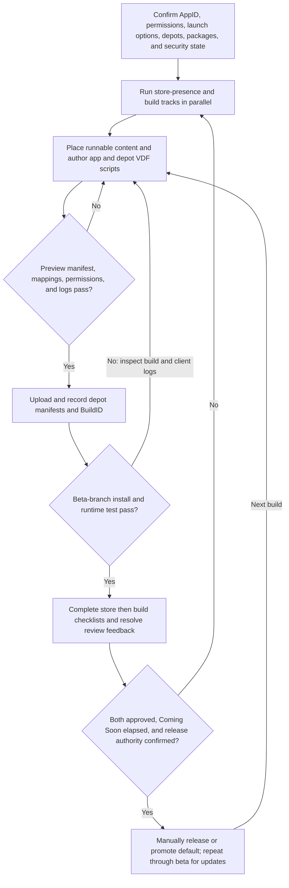

# Steamworks SteamPipe build and release

| Evidence capsule | Value |
| --- | --- |
| Scope | Storefront build, test, review, release, and update |
| Trigger | A finished game build and Steam AppID need a tested SteamPipe delivery and controlled release |
| Source | Valve's current [Uploading to Steam](https://partner.steamgames.com/doc/sdk/uploading) documentation plus the frozen [`steam-publish` agent skill](https://github.com/gamedev-skills/awesome-gamedev-agent-skills/blob/9ca5296b219049c5b68494e1f3c274ead6d727b3/skills/workflows/steam-publish/SKILL.md) |
| Author and evidence date | Valve/Steamworks; agent skill by Abhishek Barali, last changed by Ishan Gautam; live pages retrieved 2026-08-17 |
| Evidence signals | Source-documented |
| Evidence limit | The sources expose an agent-readable procedure but no named release produced by it, no independent validation, and no access to private partner artifacts. |

## Loop

## Run the loop

1. Confirm the dedicated build account has the required app permissions and that released-app
   security confirmation is available. Configure the AppID, launch options, depots, Developer Comp
   package, and published app settings; keep credentials and `config.vdf` out of the repository.
2. Run the store-presence and build tracks in parallel. Prepare the store assets and checklist while
   putting the exact runnable build in `ContentBuilder/content` and authoring app/depot VDF mappings,
   output paths, exclusions, and file properties.
3. Use a Preview build to inspect the file manifest and logs without upload. Correct VDF paths,
   filters, package/depot ownership, or permissions until the preview gate passes; then upload with
   `steamcmd` and record depot manifest IDs and the global BuildID.
4. Assign the build to a beta branch, use Preview Change and Set Build Live Now, install through the
   Steam client, and run the game. On failure, inspect `BuildOutput/*.log`, client commands,
   `content_log.txt`, and the app manifest, then return to content or VDF configuration.
5. Submit store presence before the build checklist, resolve Valve feedback, and wait for both
   approvals and the required Coming Soon period. A release-authorized human then performs the
   explicit Release App, Publish Now, and Release Now confirmation. Updates repeat through a beta
   branch before manual default promotion.

## Outputs and stop conditions

Outputs include app and depot configuration, store-presence artifacts, runnable content, VDF scripts,
preview manifest/logs, depot manifests, BuildID, beta assignment, installed runtime result, two review
decisions, and the live/default release record. Stop for missing permissions, security delay, failed
preview/upload/runtime gates, unresolved review feedback, or incomplete Coming Soon requirements.
Steam does not auto-release an approved title, and the default branch cannot be set live automatically.

## Supporting skills

**Observed:** Steamworks App Admin, Steamworks SDK ContentBuilder, SteamPipeGUI, `steamcmd`, VDF app
and depot scripts, Preview/Local/SetLive controls, beta branches, Steam client diagnostics, CI token
preservation, store/build checklists, and the frozen `itch-publish` handoff.

**Potential (inference):** depot-plan authoring, VDF validation, secret-artifact custody, build-identity
recording, cross-platform install smoke testing, review-feedback routing, release authorization, and
rollback planning. These may not exist as reusable skills.

## Evidence boundaries

- Valve's live pages expose no immutable revision or reusable content license. Steamworks access,
  SDK files, accounts, permissions, agreements, review rules, and security delays can change and must
  be refreshed before execution.
- The frozen agent wrapper is Apache-2.0; it does not license Valve documentation, Steamworks tooling,
  game content, store assets, credentials, or third-party dependencies.
- Preview proves file mapping, not installation or gameplay. A beta runtime check does not establish
  certification, player experience, store accuracy, or commercial readiness.
- The page includes the store-presence track because the frozen agent skill and Valve release process
  make its prior approval a literal release dependency. Pricing, tax, and marketing strategy remain
  outside this workflow.

## Sources

- [Current Steam build account, ContentBuilder, VDF, upload, preview, and debugging procedure](https://partner.steamgames.com/doc/sdk/uploading)
- [Current beta-branch promotion steps](https://partner.steamgames.com/doc/store/application/branches)
- [Current Steam test options and update-test branch](https://partner.steamgames.com/doc/store/testing)
- [Current two-checklist review and manual release gate](https://partner.steamgames.com/doc/store/releasing)
- [Frozen agent setup, upload, test, review, release, and update loop](https://github.com/gamedev-skills/awesome-gamedev-agent-skills/blob/9ca5296b219049c5b68494e1f3c274ead6d727b3/skills/workflows/steam-publish/SKILL.md#L30-L76)
- [Frozen advanced scripts, beta, CI, and troubleshooting reference](https://github.com/gamedev-skills/awesome-gamedev-agent-skills/blob/9ca5296b219049c5b68494e1f3c274ead6d727b3/skills/workflows/steam-publish/references/steampipe-build-scripts.md)
- [Frozen parent repository license](https://github.com/gamedev-skills/awesome-gamedev-agent-skills/blob/9ca5296b219049c5b68494e1f3c274ead6d727b3/LICENSE)
- [Goal 04 source audit and diagram mapping](../objectives/skill-process/research/09-recursive-wave-01-outcome.md#steamworks-steampipe-build-and-release-diagram-mapping)
