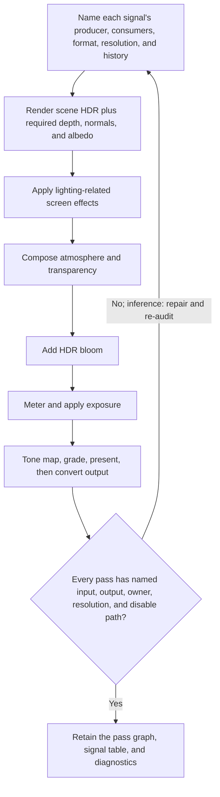

# Three.js final-image pipeline

| Evidence capsule | Value |
| --- | --- |
| Scope | Technical graphics: coordinating multiple image-space systems in a Three.js scene |
| Trigger | Multiple effects must share scene buffers, ordering, resolution, or output ownership |
| Source | Scott Sun's [`threejs-image-pipeline` skill](https://github.com/scottstts/Threejs-Awesome-Graphics-Agent-Skills/blob/98453747cc0678f6a5d910f38d7483596a5f9a40/skills/threejs-image-pipeline/SKILL.md) |
| Author and evidence date | Scott Sun; source snapshot 2026-08-15, retrieved 2026-08-16 |
| Evidence signals | Source-documented; Author-practiced |
| Evidence limit | The source reports its own practice. No independent study establishes quality, performance, or cross-engine portability. |

## Loop

## Run the loop

1. Before implementation, write the signal contract: one producer, named consumers, space and
   format, resolution, history, and ownership for each shared buffer.
2. Preserve the source's order: scene HDR and required geometry buffers; lighting effects;
   atmosphere and transparency; bloom; exposure; tone mapping; grading; lens or presentation;
   output conversion.
3. Build pass toggles and stable inspection views before tuning. Inspect scene HDR, shared buffers,
   each contribution, exposure, pre/post tone map, pass sizes, memory, and GPU time.
4. Accept the graph only when every enabled pass has a named input, output, owner, resolution, and
   disable path. Otherwise repair the signal contract or pass order and re-inspect the graph. That
   repair-and-repeat connector is editorial inference; the source states the gate and failure
   evidence, but not a literal retry step.

## Outputs and stop conditions

The output is an auditable pass graph plus its signal-ownership table and diagnostic views. Stop at
the acceptance gate. Do not claim runtime ownership until the actual render-loop call path is
verified, and do not claim velocity ownership or general temporal antialiasing when the graph does
not define them.

## Supporting skills

**Observed:** `threejs-screen-space-ambient-occlusion`, `threejs-bloom`, and
`threejs-exposure-color-grading` are loaded only when their effects are requested.

**Potential (inference):** render-signal inventory, pass-graph inspection, render-target budgeting,
color-pipeline auditing, and runtime-path verification.

## Evidence boundaries

This is a Three.js coordination workflow, not a general game-image pipeline. API names and graph
variants are renderer- and version-sensitive. The skill text is MIT licensed at the frozen
revision; source implementations and assets referenced by its ledger can carry different or
author-asserted license terms, so check their notices before copying or running them.

## Sources

- [Signal order, rules, and routing boundary](https://github.com/scottstts/Threejs-Awesome-Graphics-Agent-Skills/blob/98453747cc0678f6a5d910f38d7483596a5f9a40/skills/threejs-image-pipeline/SKILL.md#L8-L51)
- [Production image-pipeline contracts](https://github.com/scottstts/Threejs-Awesome-Graphics-Agent-Skills/blob/98453747cc0678f6a5d910f38d7483596a5f9a40/skills/threejs-image-pipeline/references/production-image-pipeline.md)
- [Source-material ledger and practice map](https://github.com/scottstts/Threejs-Awesome-Graphics-Agent-Skills/blob/98453747cc0678f6a5d910f38d7483596a5f9a40/source_materials/README.md#L32-L49)
- [Third-party notices](https://github.com/scottstts/Threejs-Awesome-Graphics-Agent-Skills/blob/98453747cc0678f6a5d910f38d7483596a5f9a40/source_materials/THIRD_PARTY_NOTICES.md)
- [MIT license](https://github.com/scottstts/Threejs-Awesome-Graphics-Agent-Skills/blob/98453747cc0678f6a5d910f38d7483596a5f9a40/LICENSE)
