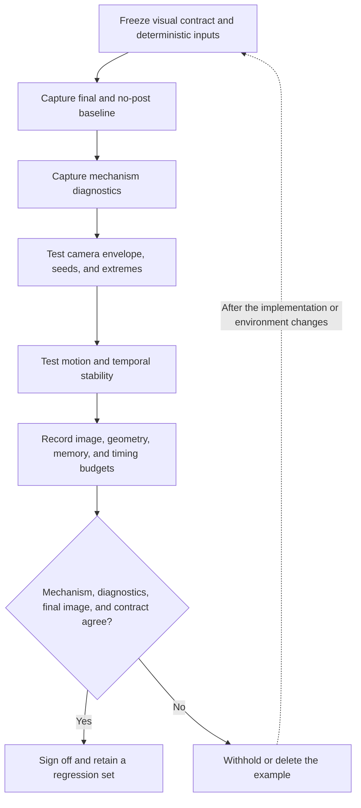

# Three.js visual-system validation

| Evidence capsule | Value |
| --- | --- |
| Scope | Verification of an authored Three.js visual system |
| Trigger | A subject or image-effect implementation exists and needs an acceptance decision |
| Source | Scott Sun's [`threejs-visual-validation` skill](https://github.com/scottstts/Threejs-Awesome-Graphics-Agent-Skills/blob/98453747cc0678f6a5d910f38d7483596a5f9a40/skills/threejs-visual-validation/SKILL.md) |
| Author and evidence date | Scott Sun; source snapshot 2026-08-15, retrieved 2026-08-16 |
| Evidence signals | Source-documented; Author-practiced |
| Evidence limit | The source reports its own practice. No independent study establishes effectiveness or portability beyond its Three.js context. |

## Loop

## Run the loop

1. Write observable visual invariants, allowed divergences, camera range, and budgets. Freeze the
   seed, camera, viewport, DPR, time, quality tier, backend, and asset versions.
2. Capture the final frame and a no-post baseline, then capture the controlling fields, buffers, or
   passes that prove the mechanism.
3. Exercise near, design, and far cameras; representative seeds and extremes; then motion,
   disocclusion, invalidation, recovery, and other relevant temporal cases.
4. Record image and geometry counts, render-target inventory, CPU time, GPU time when available,
   memory, and the active quality tier.
5. Accept only when the declared mechanism, inspectable implementation, diagnostics, and final
   image agree with the visual contract.

## Outputs and stop conditions

The output is a sign-off record plus a small regression set: fixed inputs, final and no-post
captures, diagnostic evidence, scale and stress cases, metrics, known defects, and a review
decision. Withhold an example when deterministic evidence is impossible, the mechanism cannot be
inspected, post-processing manufactures missing form, or the declared performance envelope fails.
Repeat the same evidence after mechanism, Three.js, backend, camera, or quality-tier changes.

## Supporting skills

**Observed:** The source routes first to the Three.js subject or image-effect skill, then applies
`threejs-visual-validation`. It also names deterministic capture and example-gallery tooling.

**Potential (inference):** visual-contract authoring, deterministic scene capture, diagnostic-view
capture, temporal replay, GPU-budget reporting, and regression-evidence management.

## Evidence boundaries

This is a source-authored acceptance protocol, not proof that a visual system is broadly effective.
Its budgets, mechanisms, and capture controls remain implementation-specific. The skill text is MIT
licensed at the frozen revision; copied examples and assets can have separate notices in the source
repository.

## Sources

- [Validation sequence and required evidence](https://github.com/scottstts/Threejs-Awesome-Graphics-Agent-Skills/blob/98453747cc0678f6a5d910f38d7483596a5f9a40/skills/threejs-visual-validation/SKILL.md#L10-L48)
- [Graphics validation protocol](https://github.com/scottstts/Threejs-Awesome-Graphics-Agent-Skills/blob/98453747cc0678f6a5d910f38d7483596a5f9a40/skills/threejs-visual-validation/references/graphics-validation-protocol.md)
- [Source-material ledger and practice map](https://github.com/scottstts/Threejs-Awesome-Graphics-Agent-Skills/blob/98453747cc0678f6a5d910f38d7483596a5f9a40/source_materials/README.md#L32-L49)
- [MIT license](https://github.com/scottstts/Threejs-Awesome-Graphics-Agent-Skills/blob/98453747cc0678f6a5d910f38d7483596a5f9a40/LICENSE)
