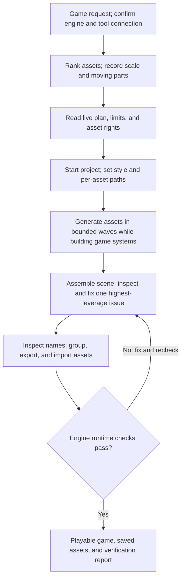

# Thrixel Goal to Game pipeline

| Evidence capsule | Value |
| --- | --- |
| Scope | End-to-end |
| Trigger | A user asks an agent to build a 3D game in Unity or Three.js |
| Source | [Thrixel Goal to Game at `db2fd7d`](https://github.com/thrixel/goal-to-game/tree/db2fd7dc7260f1bb973903b9c0c943ecd2111ac9) |
| Author and evidence date | Sining; source revised 2026-08-15 and retrieved 2026-08-16 |
| Evidence signals | Source-documented |
| Evidence limit | Vendor-authored instructions; no independent effectiveness, quality, or production validation |

## Loop

## Run the loop

1. Confirm the Thrixel connector and skill are available, settle the target engine from the request
   or project, and read that engine's source file. Write the complete asset list, rank it by player
   noticeability, and record real-world scale and independently moving parts.
2. Read live account status and pricing rather than remembered limits. On the free plan, resolve the
   source's required user choice before the first paid generation. The current Terms make asset
   rights depend on the plan at generation time.
3. Start or resume the game's Thrixel project. Put reusable textual constraints in a project source,
   establish a finished asset as the visual style reference, and choose Architect, Architect then
   Detailer, or Sculptor per asset from its articulation and fidelity needs.
4. Generate base meshes in waves no larger than the live concurrency cap. While jobs run, build the
   game systems and use accepted assets as they arrive. Inspect every thumbnail. For a hero asset,
   place it in the scene, capture it in context, name the worst mismatch, make one scoped edit, and
   look again.
5. Optionally detail or retexture, then reduce to the triangle budget. Inspect real node names before
   grouping, merge static parts, retain moving groups, and export the engine's format. Unity requires
   FBX in the source. Correct scale and forward direction during import.
6. Run the engine branch. Unity uses multi-angle scene and play-mode screenshots plus a scripted
   playtest. Three.js uses named shots, capture, a contact sheet, measurement, smoke checks, and
   recapture. Fix one measured asset or coupled-system issue and repeat. Stop a repeated review when
   the score plateaus; change the measurement or report the named remaining gap.

## Outputs and stop conditions

The pipeline produces a playable game, ranked asset list, project style sources, saved submission
IDs, scene captures, grouped engine assets, runtime-check results, and an honest gap report. Repair
the project association before generation if a result is not filed under the active project. Retry
grouping with inspected names if a retained group does not match. If credits run out, preserve the
completed game and assets, keep missing assets visibly identified, and return the unresolved list to
the user. A runtime failure returns to measured correction and recapture.

## Supporting skills

**Observed:** Thrixel MCP account, project, generation, edit, inspect, grouping, reduction, and
download tools; Unity CLI and play mode; Three.js capture, contact-sheet, pixel-statistics, smoke,
pixel-diff, and profiling tools.

**Potential (inference):** Asset-list prioritization, art-direction authoring, reference comparison,
mesh-budget planning, engine-import QA, gameplay-test authoring, and license-attribution tracking.
These capabilities may not exist as reusable skills.

## Evidence boundaries

- The repository is Apache-2.0, but Thrixel is a proprietary hosted service. The service Terms, not
  the repository license, govern generated 3D objects. The [current Terms](https://www.thrixel.com/terms-of-service#3-content-and-intellectual-property-rights)
  assign free-plan objects CC BY 4.0 with Thrixel attribution and give paid-plan users their rights
  at generation time. They do not guarantee uniqueness, copyrightability, accuracy, fitness, or
  data retention. Download and preserve accepted assets.
- Limits and prices are mutable. The [current API defaults](https://thrixel.com/docs/getting-started#rate-limits)
  are not a substitute for live account limits. The Unity branch says concurrency is account-wide.
- The frozen skill contradicts itself about image input: it says Thrixel accepts text or image,
  later says never pass an image, and elsewhere instructs Sculptor to receive one. The current
  [Sculptor](https://thrixel.com/docs/sculptor) and [Image Hub](https://thrixel.com/docs/imagehub)
  docs accept images. Treat input policy as unresolved and check the current endpoint before use.
- The Three.js method attributes its measurements to an unnamed reference project. This page uses
  only its public source-documented checks; it does not adopt those measurements as validation.
- The source's “AAA,” frame-rate, cost, and quality statements are vendor-authored. Admission does
  not validate them. Export support does not prove engine-neutral portability.
- GLB is immediately available; [other export formats](https://thrixel.com/docs/download) use
  on-demand conversion. Detailer part preservation is experimental, and grouping pivots can require
  engine-side correction.

## Sources

- [Frozen Goal to Game README](https://github.com/thrixel/goal-to-game/blob/db2fd7dc7260f1bb973903b9c0c943ecd2111ac9/README.md)
- [Frozen shared game and asset workflow](https://github.com/thrixel/goal-to-game/blob/db2fd7dc7260f1bb973903b9c0c943ecd2111ac9/skills/goal-to-game/SKILL.md#L99-L648)
- [Frozen Unity import and runtime-verification branch](https://github.com/thrixel/goal-to-game/blob/db2fd7dc7260f1bb973903b9c0c943ecd2111ac9/skills/goal-to-game/engines/unity.md#L6-L95)
- [Frozen Three.js build and review branch](https://github.com/thrixel/goal-to-game/blob/db2fd7dc7260f1bb973903b9c0c943ecd2111ac9/skills/goal-to-game/engines/threejs/threejs.md#L16-L350)
- [Frozen Three.js review process](https://github.com/thrixel/goal-to-game/blob/db2fd7dc7260f1bb973903b9c0c943ecd2111ac9/skills/goal-to-game/engines/threejs/PROCESS.md)
- [Current Thrixel API overview](https://thrixel.com/docs/)
- [Current edit contract](https://thrixel.com/docs/edit)
- [Current detail, texture, and part-preservation contract](https://thrixel.com/docs/detailer)
- [Current remesh contract](https://thrixel.com/docs/remesh)
- [Frozen repository license](https://github.com/thrixel/goal-to-game/blob/db2fd7dc7260f1bb973903b9c0c943ecd2111ac9/LICENSE)
