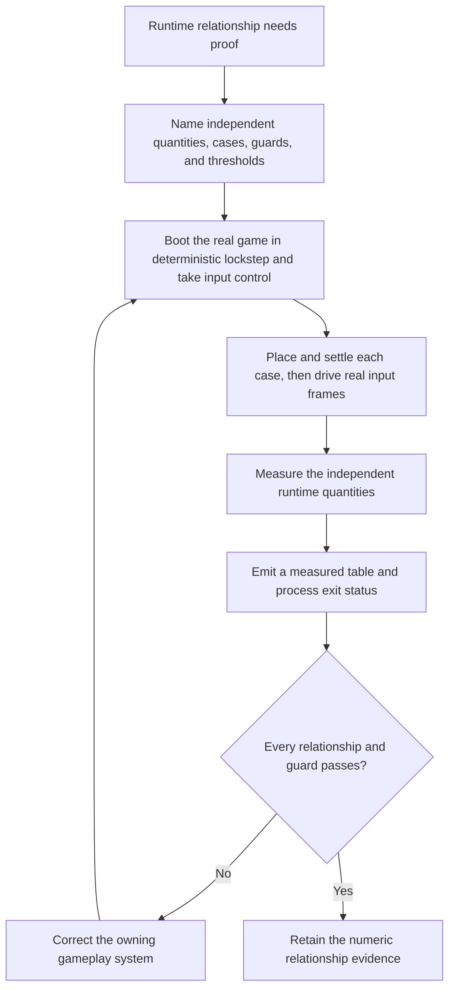

# Three.js gameplay-relationship bench

| Evidence capsule | Value |
| --- | --- |
| Scope | Non-visual gameplay verification |
| Trigger | Correctness depends on a relationship between runtime quantities that screenshots or magnitude-only smoke checks cannot prove |
| Source | [`goal-to-game` relationship bench at revision `db2fd7d`](https://github.com/thrixel/goal-to-game/blob/db2fd7dc7260f1bb973903b9c0c943ecd2111ac9/skills/goal-to-game/engines/threejs/example/feeltest.mjs) |
| Author and evidence date | Sining; selected path introduced 2026-08-12, repository revised 2026-08-15, retrieved 2026-08-17 |
| Evidence signals | Source-documented; Author-practiced |
| Evidence limit | One checked-in movement bench reports finding defects in an unnamed reference project; it does not validate the generalizations or prove gameplay quality |

## Loop

## Run the loop

1. Define the relationship and a threshold from independently observed quantities. Include a guard
   that rejects an invalid case—for example, a run deflected by level geometry—rather than letting a
   bad setup masquerade as a controller failure.
2. Boot the real game in a deterministic lockstep browser. Take control through the real input
   aggregation layer, place the actor, pump one synchronization frame, and read the start state only
   after downstream camera/game state has caught up.
3. Drive the real input path for named cases and fixed frame counts. Read comparison vectors or
   values from independent runtime authorities instead of recomputing both sides with the system
   under test.
4. Measure the relationship and relevant magnitudes. The worked bench checks movement direction
   against live camera axes across five yaws, guards minimum speed, and separately checks walk,
   sprint, strafe, and normalized diagonal speeds.
5. Print measured versus expected values and return a failing process status on any threshold miss.
   A failure goes to the owner of the gameplay relationship and reruns the bench through the
   source's measured fix/verify loop.

## Outputs and stop conditions

Outputs are the case manifest, deterministic driver, measured result object, human-readable table,
and process exit status. Stop as failed when setup throws, a guard invalidates a case, or any named
relationship crosses its threshold. Stop successfully when every relationship and guard passes.
Create a different measurement when repeated review plateaus or the current quantities cannot expose
the suspected mechanism.

## Supporting skills

**Observed:** The repository's Three.js engine kit, lockstep capture harness, Chromium automation,
real `Input.inject` events, `window.__ENGINE__` debug surface, frame pumping, and numeric self-test
table/exit helpers.

**Potential (inference):** Gameplay-invariant design, deterministic scenario authoring, independent-
authority selection, invalid-case guarding, and numeric feel regression reporting. These capabilities
may not exist as reusable skills.

## Evidence boundaries

- The source says the shape generalizes to vehicle handling, jump arcs, projectile lead, camera
  follow, and IK reach. Only the checked-in camera-relative movement and speed bench is practiced
  evidence here.
- The source attributes found bugs and larger project lessons to an unnamed reference project. The
  public code proves the bench structure, not the unnamed project's results.
- This loop is distinct from [Three.js visual-system validation](pipeline-threejs-visual-system-validation.md):
  it measures non-visual relationships through the real gameplay input/runtime path.
- The repository is Apache-2.0; Chromium, Three.js, Playwright, a game project, and other packages
  retain separate terms. Passing thresholds does not prove that the controls feel good.

## Sources

- [Bench purpose, observed miss, and stated relationship scope](https://github.com/thrixel/goal-to-game/blob/db2fd7dc7260f1bb973903b9c0c943ecd2111ac9/skills/goal-to-game/engines/threejs/example/feeltest.mjs#L1-L23)
- [Real-game lockstep setup and failure exit](https://github.com/thrixel/goal-to-game/blob/db2fd7dc7260f1bb973903b9c0c943ecd2111ac9/skills/goal-to-game/engines/threejs/example/feeltest.mjs#L24-L62)
- [Case synchronization, real input, independent authorities, and guards](https://github.com/thrixel/goal-to-game/blob/db2fd7dc7260f1bb973903b9c0c943ecd2111ac9/skills/goal-to-game/engines/threejs/example/feeltest.mjs#L66-L150)
- [Measured table and acceptance thresholds](https://github.com/thrixel/goal-to-game/blob/db2fd7dc7260f1bb973903b9c0c943ecd2111ac9/skills/goal-to-game/engines/threejs/example/feeltest.mjs#L184-L201)
- [Owner brief, verify/report contract, and measured correction loop](https://github.com/thrixel/goal-to-game/blob/db2fd7dc7260f1bb973903b9c0c943ecd2111ac9/skills/goal-to-game/engines/threejs/PROCESS.md#L85-L119)
- [Loop stop and honest-report rules](https://github.com/thrixel/goal-to-game/blob/db2fd7dc7260f1bb973903b9c0c943ecd2111ac9/skills/goal-to-game/engines/threejs/PROCESS.md#L170-L180)
- [Goal 80 source audit and diagram mapping](../objectives/skill-process/research/13-deferred-pipeline-follow-up.md#threejs-gameplay-relationship-bench-diagram-mapping)
