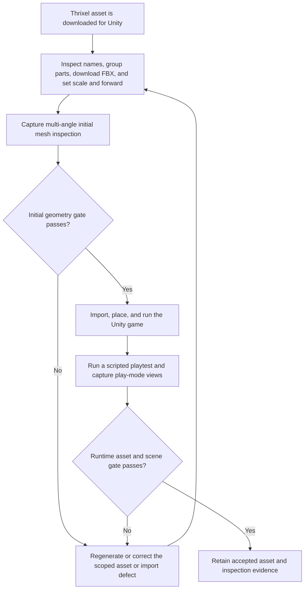

# Unity imported-asset inspection and play-mode validation

| Evidence capsule | Value |
| --- | --- |
| Scope | Engine-specific asset verification |
| Trigger | Every Thrixel asset downloaded for use in a Unity game |
| Source | [`goal-to-game` Unity branch at revision `db2fd7d`](https://github.com/thrixel/goal-to-game/blob/db2fd7dc7260f1bb973903b9c0c943ecd2111ac9/skills/goal-to-game/engines/unity.md) |
| Author and evidence date | Sining; selected path introduced 2026-08-12, repository revised 2026-08-15, retrieved 2026-08-17 |
| Evidence signals | Source-documented |
| Evidence limit | Vendor-authored instructions state the loop; no named Unity project, accepted asset record, or independent quality result is linked |

## Loop

## Run the loop

1. Inspect the real part names, group static pieces, retain independently moving groups, and download
   FBX for Unity. Set real-world scale explicitly and correct the varying forward direction once at
   import; Y is already the source's fixed up axis.
2. At initial download, inspect the mesh from multiple camera angles. Look for floating pieces,
   inverted triangles, missing parts, wrong orientation, and other large geometry defects. Regenerate
   when the source permits it or correct the scoped asset/import issue before proceeding.
3. Import and place the asset in the game. Run at least one detailed playtest script, capture multiple
   play-mode views, and inspect the actual game window rather than accepting an isolated preview.
4. At runtime, check mesh integrity, grounding, orientation, material/shader response, missing
   textures, LOD/culling transitions, collision, camera relation, and moving-part direction.
5. Return failed assets to a scoped regeneration, edit, import, or scene correction and repeat both
   affected gates. Keep the accepted FBX, grouping/scale/direction decisions, test script, and captures.

## Outputs and stop conditions

Outputs are the inspected part list, grouping decision, FBX, scale and forward settings, initial
multi-angle captures, imported Unity asset, scripted-playtest result, play-mode captures, defect log,
and acceptance decision. Stop before work when Unity CLI is unavailable as the source requires. Do
not accept an asset while either initial geometry or running-game inspection exposes a named defect.

## Supporting skills

**Observed:** Thrixel inspection, grouping, edit/regeneration, and FBX download tools; Unity CLI,
multiple scene cameras, scene mode, play mode, game-window screenshots, scripted playtests, and critic
review.

**Potential (inference):** Imported-mesh defect classification, scale/facing contract authoring,
multi-angle capture planning, Unity material/LOD inspection, and asset-acceptance reporting. These
capabilities may not exist as reusable skills.

## Evidence boundaries

- The source requires repeated critic review until an undefined “AAA” quality bar is met. This page
  preserves the observable defect loop but does not treat that vendor-authored label as measurable or
  validated.
- The broader [Thrixel Goal to Game pipeline](pipeline-thrixel-goal-to-game.md) owns game and asset
  production end to end. This page begins independently for every downloaded Unity asset and ends at
  its two inspection gates.
- The general [game-asset production](pipeline-gamedev-skills-game-asset-production.md) page covers
  asset-family direction, manifests, normalization, and provenance. It does not duplicate this
  source's FBX/grouping and initial-versus-play-mode inspection method.
- The repository is Apache-2.0, while Thrixel service terms govern generated objects. Unity, packages,
  source assets, and the resulting game retain separate rights and requirements.

## Sources

- [Unity checklist, CLI stop, and two inspection stages](https://github.com/thrixel/goal-to-game/blob/db2fd7dc7260f1bb973903b9c0c943ecd2111ac9/skills/goal-to-game/engines/unity.md#L6-L30)
- [Scripted play-mode loop and runtime defect classes](https://github.com/thrixel/goal-to-game/blob/db2fd7dc7260f1bb973903b9c0c943ecd2111ac9/skills/goal-to-game/engines/unity.md#L32-L41)
- [Unity FBX and grouping path](https://github.com/thrixel/goal-to-game/blob/db2fd7dc7260f1bb973903b9c0c943ecd2111ac9/skills/goal-to-game/engines/unity.md#L43-L66)
- [Shared edit, scale, and forward-direction rules](https://github.com/thrixel/goal-to-game/blob/db2fd7dc7260f1bb973903b9c0c943ecd2111ac9/skills/goal-to-game/SKILL.md#L439-L466)
- [Shared thumbnail/edit and grouping-before-import order](https://github.com/thrixel/goal-to-game/blob/db2fd7dc7260f1bb973903b9c0c943ecd2111ac9/skills/goal-to-game/SKILL.md#L541-L595)
- [Name-inspection and grouping failure gate](https://github.com/thrixel/goal-to-game/blob/db2fd7dc7260f1bb973903b9c0c943ecd2111ac9/skills/goal-to-game/SKILL.md#L617-L633)
- [Frozen Apache-2.0 license](https://github.com/thrixel/goal-to-game/blob/db2fd7dc7260f1bb973903b9c0c943ecd2111ac9/LICENSE)
- [Goal 80 source audit and diagram mapping](research/13-deferred-pipeline-follow-up.md#unity-imported-asset-diagram-mapping)
