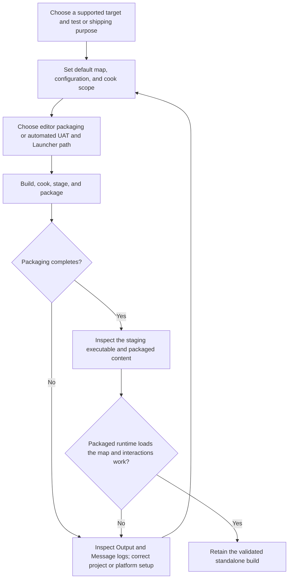

# Unreal package and runtime validation

| Evidence capsule | Value |
| --- | --- |
| Scope | Engine-specific build and runtime verification |
| Trigger | An Unreal Engine 5 project needs a standalone test or distribution build |
| Source | Epic's current [Packaging Your Project](https://dev.epicgames.com/documentation/en-us/unreal-engine/packaging-your-project) guide plus the frozen [`unreal-packaging` agent skill](https://github.com/gamedev-skills/awesome-gamedev-agent-skills/blob/9ca5296b219049c5b68494e1f3c274ead6d727b3/skills/unreal/unreal-packaging/SKILL.md) |
| Author and evidence date | Epic Games; agent skill by Abhishek Barali, last changed by Ishan Gautam; UE 5.8 page retrieved 2026-08-17 |
| Evidence signals | Source-documented |
| Evidence limit | Documentation and an agent checklist expose the loop; no named packaged game or independent outcome is linked to the checklist. |

## Loop

## Run the loop

1. Confirm the target platform is supported and its required SDK, engine components, or console
   source access is available. Choose Development or Test for diagnosis and Shipping only for a
   release artifact.
2. Set the Game Default Map, build configuration, target platform, and maps or directories to cook.
   Choose the editor's Package Project flow or a repeatable UAT/Project Launcher route.
3. Preserve Unreal's operation order: build code, cook assets, copy them to the staging directory,
   and package the distributable files. Deploy and Run are optional target-device operations.
4. On failure, inspect the Output Log and Message Log, correct the named map, cook, build, SDK, or
   platform problem, and repeat from configuration. A successful cook alone does not pass.
5. Inspect the staged executable and Pak/container content, launch the packaged build on the target,
   confirm the default map loads, exercise representative interaction, and retain the build only if
   that runtime smoke gate passes.

## Outputs and stop conditions

Outputs are the selected target/configuration, Game Default Map and cook settings, staging directory,
packaging status, logs, standalone executable/application, packaged content, and target-runtime test
result. Stop when prerequisites are absent, packaging reports failure, or the packaged runtime cannot
load and interact as intended. A validated standalone build is the handoff to a separate storefront
delivery pipeline.

## Supporting skills

**Observed:** The frozen source names Unreal Editor packaging, Maps & Modes, Packaging Settings,
`RunUAT BuildCookRun`, Unreal Automation Tool, Project Launcher, Output Log, Message Log, and related
`steam-publish` and `itch-publish` handoffs.

**Potential (inference):** platform-prerequisite auditing, cook-manifest inspection, staged-build
inventory, packaged-runtime smoke testing, log triage, and build-identity recording. These may not
exist as reusable skills.

## Evidence boundaries

- Epic's live page identified itself as Unreal Engine 5.8 on retrieval; it exposes no immutable page
  revision or reusable content license. Engine versions, platform SDKs, menus, and legal agreements
  can change, so refresh them before execution.
- The Epic tutorial's concrete run uses Windows, a Development build, and a First Person template.
  Other targets and Shipping builds require their own exit path and platform requirements.
- The frozen agent skill is Apache-2.0, but that license does not cover Unreal Engine, Epic
  documentation, target SDKs, a game project, or packaged assets.
- Passing this smoke gate does not prove performance, gameplay quality, certification, or storefront
  readiness.

## Sources

- [Current UE 5.8 packaging concepts, operations, tutorial, logs, and runtime test](https://dev.epicgames.com/documentation/en-us/unreal-engine/packaging-your-project)
- [Frozen agent workflow and runtime gate](https://github.com/gamedev-skills/awesome-gamedev-agent-skills/blob/9ca5296b219049c5b68494e1f3c274ead6d727b3/skills/unreal/unreal-packaging/SKILL.md#L28-L47)
- [Frozen failure routing and platform constraints](https://github.com/gamedev-skills/awesome-gamedev-agent-skills/blob/9ca5296b219049c5b68494e1f3c274ead6d727b3/skills/unreal/unreal-packaging/SKILL.md#L82-L96)
- [Current Unreal Automation Tool overview](https://dev.epicgames.com/documentation/unreal-engine/unreal-automation-tool-overview-for-unreal-engine)
- [Current Project Launcher reference](https://dev.epicgames.com/documentation/unreal-engine/using-the-project-launcher-in-unreal-engine)
- [Frozen parent repository license](https://github.com/gamedev-skills/awesome-gamedev-agent-skills/blob/9ca5296b219049c5b68494e1f3c274ead6d727b3/LICENSE)
- [Goal 04 source audit and diagram mapping](../objectives/skill-process/research/09-recursive-wave-01-outcome.md#unreal-package-and-runtime-validation-diagram-mapping)
